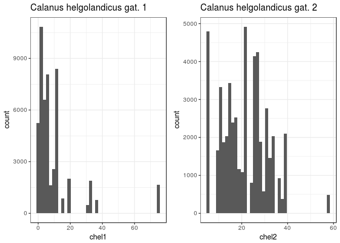
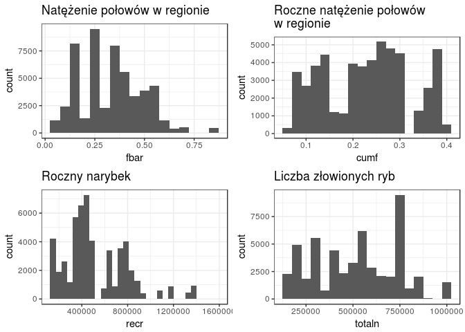
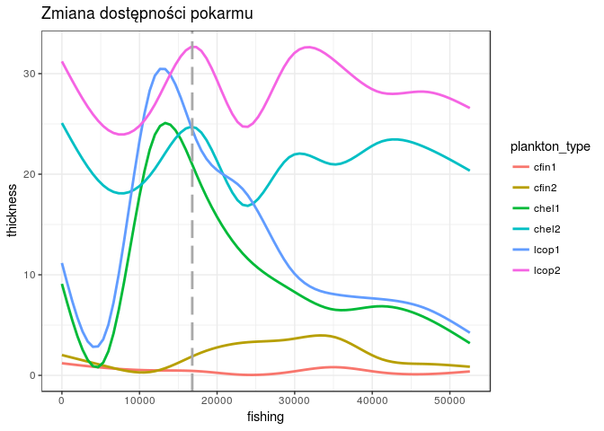

# Raport - analiza rozmarów śledzi
Martin Berent  
\`r format(Sys.Date(), "%d %B, %Y")`\  


<br>

### Dane
#### Atrybuty:

* **length:** długość złowionego śledzia [cm]
* **cfin1:** dostępność planktonu [zagęszczenie Calanus finmarchicus gat. 1]
* **cfin2:** dostępność planktonu [zagęszczenie Calanus finmarchicus gat. 2]
* **chel1:** *dostępność planktonu [zagęszczenie Calanus helgolandicus gat. 1]
* **chel2:** dostępność planktonu [zagęszczenie Calanus helgolandicus gat. 2]
* **lcop1:** dostępność planktonu [zagęszczenie widłonogów gat. 1]
* **lcop2:** dostępność planktonu [zagęszczenie widłonogów gat. 2]
* **fbar:** natężenie połowów w regionie [ułamek pozostawionego narybku]
* **recr:** roczny narybek [liczba śledzi]
* **cumf:** łączne roczne natężenie połowów w regionie [ułamek pozostawionego narybku]
* **totaln:** łączna liczba ryb złowionych w ramach połowu [liczba śledzi]
* **sst:** temperatura przy powierzchni wody [°C]
* **sal:** poziom zasolenia wody [Knudsen ppt]
* **xmonth:** miesiąc połowu [numer miesiąca]
* **nao:** oscylacja północnoatlantycka [mb]
<br><br>

#### Pierwszych pięć obserwacji:


```r
data <- read.csv("sledzie.csv", header = TRUE, sep = ",", na.strings = "?", nrows=52581)
data$xmonth <- factor(data$xmonth, sort(as.numeric(unique(data$xmonth))))
data <- data %>% rename(fishing = X)
pander(head(data))
```


|  fishing  |  length  |  cfin1  |  cfin2  |  chel1  |  chel2  |  lcop1  |  lcop2  |  fbar  |  recr  |  cumf  |  totaln  |  sst  |  sal  |  xmonth  |  nao  |
|:---------:|:--------:|:-------:|:-------:|:-------:|:-------:|:-------:|:-------:|:------:|:------:|:------:|:--------:|:-----:|:-----:|:--------:|:-----:|
|     0     |    23    | 0.02778 | 0.2778  |  2.469  |   NA    |  2.548  |  26.36  | 0.356  | 482831 | 0.306  |  267381  | 14.31 | 35.51 |    7     |  2.8  |
|     1     |   22.5   | 0.02778 | 0.2778  |  2.469  |  21.44  |  2.548  |  26.36  | 0.356  | 482831 | 0.306  |  267381  | 14.31 | 35.51 |    7     |  2.8  |
|     2     |    25    | 0.02778 | 0.2778  |  2.469  |  21.44  |  2.548  |  26.36  | 0.356  | 482831 | 0.306  |  267381  | 14.31 | 35.51 |    7     |  2.8  |
|     3     |   25.5   | 0.02778 | 0.2778  |  2.469  |  21.44  |  2.548  |  26.36  | 0.356  | 482831 | 0.306  |  267381  | 14.31 | 35.51 |    7     |  2.8  |
|     4     |    24    | 0.02778 | 0.2778  |  2.469  |  21.44  |  2.548  |  26.36  | 0.356  | 482831 | 0.306  |  267381  | 14.31 | 35.51 |    7     |  2.8  |
|     5     |    22    | 0.02778 | 0.2778  |  2.469  |  21.44  |  2.548  |   NA    | 0.356  | 482831 | 0.306  |  267381  | 14.31 | 35.51 |    7     |  2.8  |

<br>

### Podstawowe statystyki
#### Podsumowanie cech

```r
sprintf("Liczba kolumn %d", ncol(data))
```

```
## [1] "Liczba kolumn 16"
```

```r
sprintf("Liczba wierszy %d", nrow(data))
```

```
## [1] "Liczba wierszy 52581"
```

```r
sprintf("Liczba wierszy nie zawierających wartość pustą %d", nrow(na.omit(data)))
```

```
## [1] "Liczba wierszy nie zawierających wartość pustą 42488"
```

```r
pander(summary(data))
```


|    fishing    |    length    |      cfin1      |      cfin2      |     chel1      |     chel2      |      lcop1       |     lcop2      |      fbar      |
|:-------------:|:------------:|:---------------:|:---------------:|:--------------:|:--------------:|:----------------:|:--------------:|:--------------:|
| Min.   :    0 | Min.   :19.0 | Min.   : 0.0000 | Min.   : 0.0000 | Min.   : 0.000 | Min.   : 5.238 | Min.   :  0.3074 | Min.   : 7.849 | Min.   :0.0680 |
| 1st Qu.:13145 | 1st Qu.:24.0 | 1st Qu.: 0.0000 | 1st Qu.: 0.2778 | 1st Qu.: 2.469 | 1st Qu.:13.427 | 1st Qu.:  2.5479 | 1st Qu.:17.808 | 1st Qu.:0.2270 |
| Median :26290 | Median :25.5 | Median : 0.1111 | Median : 0.7012 | Median : 5.750 | Median :21.673 | Median :  7.0000 | Median :24.859 | Median :0.3320 |
| Mean   :26290 | Mean   :25.3 | Mean   : 0.4458 | Mean   : 2.0248 | Mean   :10.006 | Mean   :21.221 | Mean   : 12.8108 | Mean   :28.419 | Mean   :0.3303 |
| 3rd Qu.:39435 | 3rd Qu.:26.5 | 3rd Qu.: 0.3333 | 3rd Qu.: 1.7936 | 3rd Qu.:11.500 | 3rd Qu.:27.193 | 3rd Qu.: 21.2315 | 3rd Qu.:37.232 | 3rd Qu.:0.4560 |
| Max.   :52580 | Max.   :32.5 | Max.   :37.6667 | Max.   :19.3958 | Max.   :75.000 | Max.   :57.706 | Max.   :115.5833 | Max.   :68.736 | Max.   :0.8490 |
|      NA       |      NA      |  NA's   :1581   |  NA's   :1536   |  NA's   :1555  |  NA's   :1556  |   NA's   :1652   |  NA's   :1591  |       NA       |

Table: Table continues below

 

|      recr       |      cumf       |     totaln      |      sst      |      sal      |    xmonth     |       nao        |
|:---------------:|:---------------:|:---------------:|:-------------:|:-------------:|:-------------:|:----------------:|
| Min.   : 140515 | Min.   :0.06833 | Min.   : 144137 | Min.   :12.77 | Min.   :35.40 | 8      : 9920 | Min.   :-4.89000 |
| 1st Qu.: 360061 | 1st Qu.:0.14809 | 1st Qu.: 306068 | 1st Qu.:13.60 | 1st Qu.:35.51 | 10     : 7972 | 1st Qu.:-1.89000 |
| Median : 421391 | Median :0.23191 | Median : 539558 | Median :13.86 | Median :35.51 | 7      : 6922 | Median : 0.20000 |
| Mean   : 520368 | Mean   :0.22981 | Mean   : 514979 | Mean   :13.87 | Mean   :35.51 | 9      : 5714 | Mean   :-0.09233 |
| 3rd Qu.: 724151 | 3rd Qu.:0.29803 | 3rd Qu.: 730351 | 3rd Qu.:14.16 | 3rd Qu.:35.52 | 6      : 4217 | 3rd Qu.: 1.63000 |
| Max.   :1565890 | Max.   :0.39801 | Max.   :1015595 | Max.   :14.73 | Max.   :35.61 | 5      : 3736 | Max.   : 5.08000 |
|       NA        |       NA        |       NA        | NA's   :1584  |      NA       | (Other):14100 |        NA        |

#### Rozkład wartości cech

```r
ggplot(data, aes(length)) + geom_histogram(binwidth = 0.5) + 
  theme_bw() + ggtitle('Długość złowionego śledzia')
```

<!-- -->

```r
p_cfin1 <- ggplot(data, aes(cfin1)) + geom_histogram(bins = 40) + 
  theme_bw() + ggtitle('Calanus finmarchicus gat. 1')
p_cfin2 <- ggplot(data, aes(cfin2)) + geom_histogram(bins = 40) + 
  theme_bw() + ggtitle('Calanus finmarchicus gat. 2')
grid.arrange(p_cfin1, p_cfin2, nrow=1)
```

<!-- -->

```r
p_chel1 <- ggplot(data, aes(chel1)) + geom_histogram(bins = 40) + 
  theme_bw() + ggtitle('Calanus helgolandicus gat. 1')
p_chel2 <- ggplot(data, aes(chel2)) + geom_histogram(bins = 40) + 
  theme_bw() + ggtitle('Calanus helgolandicus gat. 2')
grid.arrange(p_chel1, p_chel2, nrow=1)
```

<!-- -->

```r
p_lcop1 <- ggplot(data, aes(lcop1)) + geom_histogram(bins = 40) + 
  theme_bw() + ggtitle('Widłonogi gat. 1')
p_lcop2 <- ggplot(data, aes(lcop2)) + geom_histogram(bins = 40) + 
  theme_bw()+ ggtitle('Widłonogi gat. 2')
grid.arrange(p_lcop1, p_lcop2, nrow=1)
```

<!-- -->

```r
p_fbar <- ggplot(data, aes(fbar)) + geom_histogram(binwidth = 0.05) + 
  theme_bw() + ggtitle('Natężenie połowów w regionie')
p_cumf <- ggplot(data, aes(cumf)) + geom_histogram(binwidth = 0.02) + 
  theme_bw() + ggtitle('Roczne natężenie połowów\nw regionie')
p_recr <- ggplot(data, aes(recr)) + geom_histogram() + 
  theme_bw() + ggtitle('Roczny narybek')
p_totaln <- ggplot(data, aes(totaln)) + geom_histogram(binwidth = 50000) + 
  theme_bw() + ggtitle('Liczba złowionych ryb')
grid.arrange(p_fbar, p_cumf, p_recr, p_totaln, nrow=2)
```

<!-- -->

```r
p_sst <- ggplot(data, aes(sst)) + geom_histogram() + 
  theme_bw() + ggtitle('Temp. przy powierzchni wody')
p_sal <- ggplot(data, aes(sal)) + geom_histogram() + 
  theme_bw() + ggtitle('Poziom zasolenia wody')
grid.arrange(p_sst, p_sal, nrow=1)
```

<!-- -->

```r
p_xmonth <- ggplot(data, aes(xmonth)) + geom_bar(stat = 'count') + 
  theme_bw() + ggtitle('Miesiąc połowu')
p_nao <- ggplot(data, aes(nao)) + geom_histogram(binwidth = 0.3) + 
  theme_bw() + ggtitle('Oscylacja północnoatlantycka')
grid.arrange(p_xmonth, p_nao, nrow=1)
```

<!-- -->

### Wartości odstające

Na podstawie wykresów obrazujących rozkład wartości można wnioskować że dla atrybutów *cfin1* oraz *lcop1* występują wartości odstające.


```r
pander(data %>% filter(cfin1 > 10 | lcop1 > 90))
```


|  fishing  |  length  |  cfin1  |  cfin2  |  chel1  |  chel2  |  lcop1  |  lcop2  |  fbar  |  recr   |  cumf   |  totaln  |  sst  |  sal  |  xmonth  |  nao  |
|:---------:|:--------:|:-------:|:-------:|:-------:|:-------:|:-------:|:-------:|:------:|:-------:|:-------:|:--------:|:-----:|:-----:|:--------:|:-----:|
|   52496   |    28    |  37.67  |  10.17  |  64.75  |  43.64  |  115.6  |  59.09  | 0.125  | 1565890 | 0.09586 |  727441  | 13.62 | 35.53 |    9     | -1.02 |
|   52497   |   24.5   |  37.67  |  10.17  |  64.75  |  43.64  |  115.6  |  59.09  | 0.125  | 1565890 | 0.09586 |  727441  | 13.62 | 35.53 |    9     | -1.02 |
|   52498   |    27    |  37.67  |  10.17  |  64.75  |  43.64  |  115.6  |  59.09  | 0.125  | 1565890 | 0.09586 |  727441  | 13.62 | 35.53 |    9     | -1.02 |
|   52499   |    26    |  37.67  |  10.17  |  64.75  |  43.64  |  115.6  |  59.09  | 0.125  | 1565890 | 0.09586 |  727441  | 13.62 | 35.53 |    9     | -1.02 |
|   52500   |   25.5   |  37.67  |  10.17  |  64.75  |  43.64  |  115.6  |  59.09  | 0.125  | 1565890 | 0.09586 |  727441  | 13.62 | 35.53 |    9     | -1.02 |
|   52501   |   24.5   |  37.67  |  10.17  |  64.75  |  43.64  |  115.6  |  59.09  | 0.125  | 1565890 | 0.09586 |  727441  | 13.62 | 35.53 |    9     | -1.02 |

Powyższe obserwacje zostaną usunięte ze zbioru danych. Poniżej rozkład wartości bez wartości odstających.


```r
data <- data %>% filter(cfin1 <= 10 | is.na(cfin1)) %>% filter(lcop1 <= 90 | is.na(lcop1))

p_cfin1 <- ggplot(data, aes(cfin1)) + geom_histogram(bins = 40) + 
  theme_bw() + ggtitle('Calanus finmarchicus gat. 1')
p_lcop1 <- ggplot(data, aes(lcop1)) + geom_histogram(bins = 40) + 
  theme_bw() + ggtitle('Widłonogi gat. 1')

grid.arrange(p_cfin1, p_lcop1, nrow=1)
```

<!-- -->

### Wartości puste

Kolumny zawierające wartości puste


```r
colnames(data)[apply(is.na(data), 2, any)]
```

```
## [1] "cfin1" "cfin2" "chel1" "chel2" "lcop1" "lcop2" "sst"
```

#### cfin1


```r
statsNA(data$cfin1, bins = 10)
```

```
## [1] "Length of time series:"
## [1] 52575
## [1] "-------------------------"
## [1] "Number of Missing Values:"
## [1] 1581
## [1] "-------------------------"
## [1] "Percentage of Missing Values:"
## [1] "3.01%"
## [1] "-------------------------"
## [1] "Stats for Bins"
## [1] "  Bin 1 (5258 values from 1 to 5258) :      159 NAs (3.02%)"
## [1] "  Bin 2 (5258 values from 5259 to 10516) :      144 NAs (2.74%)"
## [1] "  Bin 3 (5258 values from 10517 to 15774) :      172 NAs (3.27%)"
## [1] "  Bin 4 (5258 values from 15775 to 21032) :      168 NAs (3.2%)"
## [1] "  Bin 5 (5258 values from 21033 to 26290) :      153 NAs (2.91%)"
## [1] "  Bin 6 (5258 values from 26291 to 31548) :      141 NAs (2.68%)"
## [1] "  Bin 7 (5258 values from 31549 to 36806) :      181 NAs (3.44%)"
## [1] "  Bin 8 (5258 values from 36807 to 42064) :      150 NAs (2.85%)"
## [1] "  Bin 9 (5258 values from 42065 to 47322) :      156 NAs (2.97%)"
## [1] "  Bin 10 (5253 values from 47323 to 52575) :      157 NAs (2.99%)"
## [1] "-------------------------"
## [1] "Longest NA gap (series of consecutive NAs)"
## [1] "3 in a row"
## [1] "-------------------------"
## [1] "Most frequent gap size (series of consecutive NA series)"
## [1] "1 NA in a row (occuring 1480 times)"
## [1] "-------------------------"
## [1] "Gap size accounting for most NAs"
## [1] "1 NA in a row (occuring 1480 times, making up for overall 1480 NAs)"
## [1] "-------------------------"
## [1] "Overview NA series"
## [1] "  1 NA in a row: 1480 times"
## [1] "  2 NA in a row: 49 times"
## [1] "  3 NA in a row: 1 times"
```

#### cfin2


```r
statsNA(data$cfin2, bins = 10)
```

```
## [1] "Length of time series:"
## [1] 52575
## [1] "-------------------------"
## [1] "Number of Missing Values:"
## [1] 1536
## [1] "-------------------------"
## [1] "Percentage of Missing Values:"
## [1] "2.92%"
## [1] "-------------------------"
## [1] "Stats for Bins"
## [1] "  Bin 1 (5258 values from 1 to 5258) :      162 NAs (3.08%)"
## [1] "  Bin 2 (5258 values from 5259 to 10516) :      150 NAs (2.85%)"
## [1] "  Bin 3 (5258 values from 10517 to 15774) :      157 NAs (2.99%)"
## [1] "  Bin 4 (5258 values from 15775 to 21032) :      134 NAs (2.55%)"
## [1] "  Bin 5 (5258 values from 21033 to 26290) :      154 NAs (2.93%)"
## [1] "  Bin 6 (5258 values from 26291 to 31548) :      148 NAs (2.81%)"
## [1] "  Bin 7 (5258 values from 31549 to 36806) :      169 NAs (3.21%)"
## [1] "  Bin 8 (5258 values from 36807 to 42064) :      152 NAs (2.89%)"
## [1] "  Bin 9 (5258 values from 42065 to 47322) :      163 NAs (3.1%)"
## [1] "  Bin 10 (5253 values from 47323 to 52575) :      147 NAs (2.8%)"
## [1] "-------------------------"
## [1] "Longest NA gap (series of consecutive NAs)"
## [1] "3 in a row"
## [1] "-------------------------"
## [1] "Most frequent gap size (series of consecutive NA series)"
## [1] "1 NA in a row (occuring 1461 times)"
## [1] "-------------------------"
## [1] "Gap size accounting for most NAs"
## [1] "1 NA in a row (occuring 1461 times, making up for overall 1461 NAs)"
## [1] "-------------------------"
## [1] "Overview NA series"
## [1] "  1 NA in a row: 1461 times"
## [1] "  2 NA in a row: 36 times"
## [1] "  3 NA in a row: 1 times"
```

#### chel1


```r
statsNA(data$chel1, bins = 10)
```

```
## [1] "Length of time series:"
## [1] 52575
## [1] "-------------------------"
## [1] "Number of Missing Values:"
## [1] 1555
## [1] "-------------------------"
## [1] "Percentage of Missing Values:"
## [1] "2.96%"
## [1] "-------------------------"
## [1] "Stats for Bins"
## [1] "  Bin 1 (5258 values from 1 to 5258) :      138 NAs (2.62%)"
## [1] "  Bin 2 (5258 values from 5259 to 10516) :      158 NAs (3%)"
## [1] "  Bin 3 (5258 values from 10517 to 15774) :      168 NAs (3.2%)"
## [1] "  Bin 4 (5258 values from 15775 to 21032) :      173 NAs (3.29%)"
## [1] "  Bin 5 (5258 values from 21033 to 26290) :      143 NAs (2.72%)"
## [1] "  Bin 6 (5258 values from 26291 to 31548) :      150 NAs (2.85%)"
## [1] "  Bin 7 (5258 values from 31549 to 36806) :      162 NAs (3.08%)"
## [1] "  Bin 8 (5258 values from 36807 to 42064) :      154 NAs (2.93%)"
## [1] "  Bin 9 (5258 values from 42065 to 47322) :      147 NAs (2.8%)"
## [1] "  Bin 10 (5253 values from 47323 to 52575) :      162 NAs (3.08%)"
## [1] "-------------------------"
## [1] "Longest NA gap (series of consecutive NAs)"
## [1] "3 in a row"
## [1] "-------------------------"
## [1] "Most frequent gap size (series of consecutive NA series)"
## [1] "1 NA in a row (occuring 1471 times)"
## [1] "-------------------------"
## [1] "Gap size accounting for most NAs"
## [1] "1 NA in a row (occuring 1471 times, making up for overall 1471 NAs)"
## [1] "-------------------------"
## [1] "Overview NA series"
## [1] "  1 NA in a row: 1471 times"
## [1] "  2 NA in a row: 39 times"
## [1] "  3 NA in a row: 2 times"
```

#### chel2


```r
statsNA(data$chel2, bins = 10)
```

```
## [1] "Length of time series:"
## [1] 52575
## [1] "-------------------------"
## [1] "Number of Missing Values:"
## [1] 1556
## [1] "-------------------------"
## [1] "Percentage of Missing Values:"
## [1] "2.96%"
## [1] "-------------------------"
## [1] "Stats for Bins"
## [1] "  Bin 1 (5258 values from 1 to 5258) :      159 NAs (3.02%)"
## [1] "  Bin 2 (5258 values from 5259 to 10516) :      161 NAs (3.06%)"
## [1] "  Bin 3 (5258 values from 10517 to 15774) :      158 NAs (3%)"
## [1] "  Bin 4 (5258 values from 15775 to 21032) :      173 NAs (3.29%)"
## [1] "  Bin 5 (5258 values from 21033 to 26290) :      151 NAs (2.87%)"
## [1] "  Bin 6 (5258 values from 26291 to 31548) :      149 NAs (2.83%)"
## [1] "  Bin 7 (5258 values from 31549 to 36806) :      168 NAs (3.2%)"
## [1] "  Bin 8 (5258 values from 36807 to 42064) :      133 NAs (2.53%)"
## [1] "  Bin 9 (5258 values from 42065 to 47322) :      146 NAs (2.78%)"
## [1] "  Bin 10 (5253 values from 47323 to 52575) :      158 NAs (3.01%)"
## [1] "-------------------------"
## [1] "Longest NA gap (series of consecutive NAs)"
## [1] "3 in a row"
## [1] "-------------------------"
## [1] "Most frequent gap size (series of consecutive NA series)"
## [1] "1 NA in a row (occuring 1448 times)"
## [1] "-------------------------"
## [1] "Gap size accounting for most NAs"
## [1] "1 NA in a row (occuring 1448 times, making up for overall 1448 NAs)"
## [1] "-------------------------"
## [1] "Overview NA series"
## [1] "  1 NA in a row: 1448 times"
## [1] "  2 NA in a row: 51 times"
## [1] "  3 NA in a row: 2 times"
```

#### lcop1


```r
statsNA(data$lcop1, bins = 10)
```

```
## [1] "Length of time series:"
## [1] 52575
## [1] "-------------------------"
## [1] "Number of Missing Values:"
## [1] 1652
## [1] "-------------------------"
## [1] "Percentage of Missing Values:"
## [1] "3.14%"
## [1] "-------------------------"
## [1] "Stats for Bins"
## [1] "  Bin 1 (5258 values from 1 to 5258) :      177 NAs (3.37%)"
## [1] "  Bin 2 (5258 values from 5259 to 10516) :      189 NAs (3.59%)"
## [1] "  Bin 3 (5258 values from 10517 to 15774) :      144 NAs (2.74%)"
## [1] "  Bin 4 (5258 values from 15775 to 21032) :      148 NAs (2.81%)"
## [1] "  Bin 5 (5258 values from 21033 to 26290) :      160 NAs (3.04%)"
## [1] "  Bin 6 (5258 values from 26291 to 31548) :      177 NAs (3.37%)"
## [1] "  Bin 7 (5258 values from 31549 to 36806) :      163 NAs (3.1%)"
## [1] "  Bin 8 (5258 values from 36807 to 42064) :      149 NAs (2.83%)"
## [1] "  Bin 9 (5258 values from 42065 to 47322) :      178 NAs (3.39%)"
## [1] "  Bin 10 (5253 values from 47323 to 52575) :      167 NAs (3.18%)"
## [1] "-------------------------"
## [1] "Longest NA gap (series of consecutive NAs)"
## [1] "2 in a row"
## [1] "-------------------------"
## [1] "Most frequent gap size (series of consecutive NA series)"
## [1] "1 NA in a row (occuring 1550 times)"
## [1] "-------------------------"
## [1] "Gap size accounting for most NAs"
## [1] "1 NA in a row (occuring 1550 times, making up for overall 1550 NAs)"
## [1] "-------------------------"
## [1] "Overview NA series"
## [1] "  1 NA in a row: 1550 times"
## [1] "  2 NA in a row: 51 times"
```

#### lcop2


```r
statsNA(data$lcop2, bins = 10)
```

```
## [1] "Length of time series:"
## [1] 52575
## [1] "-------------------------"
## [1] "Number of Missing Values:"
## [1] 1591
## [1] "-------------------------"
## [1] "Percentage of Missing Values:"
## [1] "3.03%"
## [1] "-------------------------"
## [1] "Stats for Bins"
## [1] "  Bin 1 (5258 values from 1 to 5258) :      154 NAs (2.93%)"
## [1] "  Bin 2 (5258 values from 5259 to 10516) :      165 NAs (3.14%)"
## [1] "  Bin 3 (5258 values from 10517 to 15774) :      181 NAs (3.44%)"
## [1] "  Bin 4 (5258 values from 15775 to 21032) :      162 NAs (3.08%)"
## [1] "  Bin 5 (5258 values from 21033 to 26290) :      147 NAs (2.8%)"
## [1] "  Bin 6 (5258 values from 26291 to 31548) :      151 NAs (2.87%)"
## [1] "  Bin 7 (5258 values from 31549 to 36806) :      145 NAs (2.76%)"
## [1] "  Bin 8 (5258 values from 36807 to 42064) :      157 NAs (2.99%)"
## [1] "  Bin 9 (5258 values from 42065 to 47322) :      177 NAs (3.37%)"
## [1] "  Bin 10 (5253 values from 47323 to 52575) :      152 NAs (2.89%)"
## [1] "-------------------------"
## [1] "Longest NA gap (series of consecutive NAs)"
## [1] "3 in a row"
## [1] "-------------------------"
## [1] "Most frequent gap size (series of consecutive NA series)"
## [1] "1 NA in a row (occuring 1503 times)"
## [1] "-------------------------"
## [1] "Gap size accounting for most NAs"
## [1] "1 NA in a row (occuring 1503 times, making up for overall 1503 NAs)"
## [1] "-------------------------"
## [1] "Overview NA series"
## [1] "  1 NA in a row: 1503 times"
## [1] "  2 NA in a row: 41 times"
## [1] "  3 NA in a row: 2 times"
```

#### sst


```r
statsNA(data$sst, bins = 10)
```

```
## [1] "Length of time series:"
## [1] 52575
## [1] "-------------------------"
## [1] "Number of Missing Values:"
## [1] 1584
## [1] "-------------------------"
## [1] "Percentage of Missing Values:"
## [1] "3.01%"
## [1] "-------------------------"
## [1] "Stats for Bins"
## [1] "  Bin 1 (5258 values from 1 to 5258) :      162 NAs (3.08%)"
## [1] "  Bin 2 (5258 values from 5259 to 10516) :      159 NAs (3.02%)"
## [1] "  Bin 3 (5258 values from 10517 to 15774) :      153 NAs (2.91%)"
## [1] "  Bin 4 (5258 values from 15775 to 21032) :      160 NAs (3.04%)"
## [1] "  Bin 5 (5258 values from 21033 to 26290) :      141 NAs (2.68%)"
## [1] "  Bin 6 (5258 values from 26291 to 31548) :      157 NAs (2.99%)"
## [1] "  Bin 7 (5258 values from 31549 to 36806) :      160 NAs (3.04%)"
## [1] "  Bin 8 (5258 values from 36807 to 42064) :      150 NAs (2.85%)"
## [1] "  Bin 9 (5258 values from 42065 to 47322) :      183 NAs (3.48%)"
## [1] "  Bin 10 (5253 values from 47323 to 52575) :      159 NAs (3.03%)"
## [1] "-------------------------"
## [1] "Longest NA gap (series of consecutive NAs)"
## [1] "3 in a row"
## [1] "-------------------------"
## [1] "Most frequent gap size (series of consecutive NA series)"
## [1] "1 NA in a row (occuring 1501 times)"
## [1] "-------------------------"
## [1] "Gap size accounting for most NAs"
## [1] "1 NA in a row (occuring 1501 times, making up for overall 1501 NAs)"
## [1] "-------------------------"
## [1] "Overview NA series"
## [1] "  1 NA in a row: 1501 times"
## [1] "  2 NA in a row: 40 times"
## [1] "  3 NA in a row: 1 times"
```

#### Wypełniane 

Dla wszystkich powyższych atrubutów wartości puste stanowią mniej niż 5% obserwacji. Ich rokład jest równomierny i ma charakter losowy. Sekwencje dwóch lub trzech wartości pustych są rzadkie. W związku z tym wartości puste będą imputowane z użyciem filtru Kalmana.   


```r
data$cfin1 <- na.kalman(data$cfin1)
data$cfin2 <- na.kalman(data$cfin2)
data$chel1 <- na.kalman(data$chel1)
data$chel2 <- na.kalman(data$chel2)
data$lcop1 <- na.kalman(data$lcop1)
data$lcop2 <- na.kalman(data$lcop2)
data$sst <- na.kalman(data$sst)
```

### Korelacja

Do przygotowania wykresu nie użyto kolumny identyfikującej połów oraz kolumny określającej miesiąc połowu.


```r
M<-cor(data[, -c(1,15)])
corrplot(M, method="circle")
```

<!-- -->


```r
data_sample <- data
ggplot(data_sample, aes(nao, lcop1)) + 
  geom_point() + 
  geom_smooth(color="green", method="lm") + 
  theme_bw()
```

<!-- -->


```r
data_sample <- data
ggplot(data_sample, aes(nao, chel1)) + 
  geom_point() + 
  geom_smooth(color="green", method="lm") + 
  theme_bw()
```

<!-- -->


```r
data_sample <- data
ggplot(data_sample, aes(sst, length)) + 
  geom_point() + 
  geom_smooth(color="green", method="lm") + 
  theme_bw()
```

<!-- -->

### Zmienność cech w kolejnych połowach 

Szarą przerywaną linią oznaczono połów rozpoczynający zmianę trendu długości złowionego śledzia 


```r
data_sample <- sample_n(data, 500)
q <- ggplot(data_sample, aes(fishing, length)) + 
  geom_jitter() + 
  geom_smooth(se = FALSE, color="green") + 
  geom_vline(xintercept = 17000, colour="darkgray", linetype = "longdash", size=1) + 
  ggtitle('Zmiana długości złowionego śledzia') +
  theme_bw()
ggplotly(q)
```

<!--html_preserve--><div id="htmlwidget-1cd03958f9c80755324c" style="width:672px;height:480px;" class="plotly html-widget"></div>
<script type="application/json" data-for="htmlwidget-1cd03958f9c80755324c">{"x":{"data":[{"x":[26881.1941087652,21360.9370327476,16854.8206521563,508.798248959892,52242.942035847,17388.6349190269,47974.3956292454,3595.18017371148,4868.05468506739,33982.0874517238,37216.3552614935,21168.3191198943,44408.2939045111,29083.25934751,42879.7194470465,21826.6296364138,4969.87861802857,2688.68440104369,5715.9389673451,29627.8277949879,29030.2698308637,31600.8276360894,1388.10373590961,24343.2274458248,23630.2992023747,4982.86962393932,9852.85003524404,31073.268366655,5582.08076121509,9395.33841250148,25612.38586482,34739.891555104,47008.88733433,40204.7267532282,10655.6231169045,49601.6428652003,6486.27911090478,20593.8549232842,5724.66726004481,543.229586206004,41086.6853517145,43018.172610881,19963.9765953308,14477.0364127237,8404.06025895774,42226.6120512208,46355.2554998977,26738.8406528994,43621.3177866239,43131.8724737948,36275.6034687813,32540.6190851187,14482.6993286582,1217.65977329649,14450.3090452654,15487.081740725,11543.0344889397,40960.6403049145,24529.7154415678,24258.3825199632,49921.9570328563,45129.1265059093,39491.7720854972,3366.65566446166,4939.08990986291,13241.9144707635,31141.7101594733,17960.9532407664,38497.0922247753,9278.25331742186,4162.75099690054,29567.1391936202,45350.906495606,20281.3283632651,7928.61767059527,38685.3900735112,33983.7262118436,28348.0052831035,22892.0304508122,49565.1857469134,31842.1446864825,47986.6041341912,52097.9498838743,49547.9315267891,40357.9287890254,43743.2853507424,35021.8342942145,8328.30351167656,41501.3966107214,42690.8622349294,6138.72910495345,7056.07351409402,44976.7811482863,30921.077194179,45962.1295765791,42129.00577807,20138.2153294399,2677.10963631272,21701.733667043,41003.0575430967,33134.0586135084,2782.08688803017,43551.1800859671,50948.9654978691,2485.71855214853,31935.2911040321,16487.1987132162,51315.9717460159,51985.789349007,7965.0714058293,41955.3778455365,16997.8745676123,16209.0569527736,29435.6614371922,2081.39256657977,40458.6407417007,19557.2387031276,46114.7612609986,51914.0323270481,43293.9660491565,42476.948247572,45329.0132209886,6297.64261675607,34575.2794744682,17276.8231271539,52067.2802904937,39240.7752914647,25556.9614164028,21061.1627150131,2145.35356155876,16924.1656926569,2794.92837575767,50702.1858812479,9623.31736154724,2491.95459136572,16223.8304299347,42263.9641941031,45003.3869560367,46832.0859254973,29269.8905775925,33519.0617099585,32798.8993867708,21332.9780690664,5974.90099008642,41352.7175847644,22260.394962159,10676.2273274234,884.817764892429,37765.6074106123,13126.9035706341,7198.61564644575,30714.6001356926,6865.75336821377,51248.6601791896,33078.1422281113,40645.9470373379,4770.91627873555,43065.6912395343,12964.3594057748,13130.269979565,20569.3379166918,21721.9581096819,25454.7210857987,51974.3912033971,44885.7584897956,27689.3251088548,9351.27063620668,25339.3792886933,51079.1826204767,7704.0808176985,18276.3579769375,48920.6205477457,30314.8931184918,20662.8538434943,24568.3539830415,44576.1162246043,2765.78953079823,45335.6185741765,12570.9406692941,50830.197164968,8914.38458360154,4084.82869027201,37618.0502704501,34691.9516226413,29444.612715508,5278.97026243154,30715.777564368,21733.6890136773,38613.2782880263,26644.6612471895,29500.7356945032,29416.8692517659,45590.7448417462,11960.2592536623,43327.9288199812,1365.64962500036,36806.9599637777,34755.1462369151,37061.138613835,49572.6476557603,46581.7920037262,17513.1543636724,42583.2163122455,13183.8286230117,11201.7311411288,31925.0067960501,47500.1319276582,12809.1383329248,46404.9146221772,45536.0331458922,39838.2716320669,23076.1154865375,4200.19694867041,39357.945748901,43383.9319973156,44483.7336729741,6013.93222287595,37754.7196261864,32427.981611505,15963.092039399,18018.8785388844,27073.6068743002,5848.16985729374,29731.6125510158,25153.306182261,45211.1263795838,14975.3174704483,32349.9568349583,51397.7795867503,7103.76811663844,50403.8715695636,41614.1582338505,14997.7296075853,29046.0140389932,22473.9985870279,42173.8731106022,5750.32887205873,25882.2879606396,37495.9619051756,27318.7406769335,12314.6656969452,10980.6286189899,12015.8386472074,40851.3588119118,49743.804638036,20699.0853634279,41065.0699139109,6177.87510902788,11005.1388650367,28897.320742034,36812.6736699587,16066.7046496706,39181.1594305323,26635.9604200266,42376.8206161471,40303.3425700517,11865.7712468879,27983.8548243282,31757.9694794668,23584.6797664409,10610.1223247053,8271.23845177572,25529.1328985393,1984.0339394128,34162.1035236912,46794.2865858681,27721.2256674703,9390.63338537403,40932.1104572881,15598.6485670486,45645.8214955403,9960.78343693949,32047.916198937,43886.2785729347,36496.3078819035,8659.29353950843,34937.070361675,29948.1136145173,19255.9766197816,51590.0453229843,30586.7209633319,4780.04498510379,36630.7458480807,20651.8700406054,50858.8830439858,40338.6524510011,25775.6451559128,52011.1960290167,17170.6896544941,156.036263102107,13179.8846493607,40321.6562477062,50934.3956513228,16226.3529787779,44111.0610020751,42009.1754941879,43576.348839925,31190.7956014743,28426.0573484892,28072.9447715407,3507.1032361567,43719.6018346842,34602.8405060226,26054.7527581885,34354.7399375482,16068.6088126387,36693.1921897123,15581.9475082815,42908.0671187742,30514.3368669922,47950.1653948236,17613.8434705021,4290.38766236752,19207.0069213465,49078.6086498035,47334.0207688438,44710.6113161867,14208.148230969,8416.36587200779,30825.1081851881,35883.8593459904,27621.2643745724,16078.0012577871,22565.6307379246,3259.95153247789,28689.9662044849,42192.6281126454,43548.9623443576,28812.6756627304,26365.0352939205,33633.661281972,17114.6624975825,37622.2542159362,12903.0754479071,2754.37217366099,26119.0671320626,29348.6022870634,18991.9057781059,11156.1134108745,17273.6756376857,2839.38199153766,8121.15150880106,33378.6928534623,27401.7663693504,22791.2447296208,16639.3376169428,5775.03387004733,17985.2692733631,4988.09160109311,45076.8928553376,32575.9845045868,36012.9929405598,39627.0563402608,38942.0802214446,26899.0672397783,5339.01603036318,41139.6849445075,41359.1888684494,7670.25493740197,17790.2815100336,34622.9301718824,6790.89665659256,42127.1624492021,28085.7027729113,37068.7074739451,50215.0442776822,23259.267355351,30660.0515085729,20912.3842932083,28538.9423087748,28316.3328275958,26886.1284734225,10359.2486164043,21548.026321429,9281.83009170853,31867.9430938929,29555.0047053972,48054.1141410632,34039.775241648,1546.09760206304,25663.074810824,32680.7018579267,24548.0177565029,36735.2215326676,51844.6681186765,51144.9579572726,46299.6529221438,48345.2972370032,32381.7115601989,39793.0080076402,37158.8856828609,40279.8955837162,48687.1379204921,11164.9421481973,9812.84102176912,18806.841756014,41983.3536057794,33418.2489514751,10807.2221418874,23472.664898929,48034.0849430939,14211.9561107041,10077.9645093823,3161.72530871723,18780.7873928986,9603.62167935818,38059.8258617541,6350.60320934113,27136.1460533144,40887.6613417508,5030.88024966978,25196.6465914829,19000.9102632198,28146.3771653838,21466.2688894192,26056.0210879305,43658.1578820951,42142.8698703894,20702.0091159547,44674.2472814674,569.701594740152,41698.1892700095,24930.6867726253,41210.179782488,12187.8394499876,29175.610020465,19995.0160043262,20841.7387094308,32219.1140436934,17255.7075762112,12223.9446656903,4493.33490550481,19508.932457345,23288.0602718169,2881.83111266438,18990.6787832219,4356.17202628981,45638.9901604943,23336.0303124543,23671.6541816071,21956.7180141762,22455.8229462789,1034.8528275637,51999.6770347454,26270.9353867492,27105.7243404657,51063.1270044014,31425.346129304,8719.80662775449,31038.2897226868,9404.1609617468,15437.6343653373,49214.2113928407,2088.76685741451,49150.8735410588,17873.1522622943,29652.3461584404,20821.990081007,49864.902884295,8525.36805986594,23779.0136450252,8273.9430938879,7625.8981794389,2943.09720474686,47824.0675063595,42331.9075076316,28074.7158033568,18784.8425406747,42859.0176374394,51147.0436720729,33656.8865672912,42407.3696595579,11324.7657757508,37501.9009841101,21828.9253092445,40787.7940681471,24910.6103134386,34948.169940502,23588.7316605443,47415.8932334034,36135.7101291809,46721.3266181687,48591.1199222581,16631.8976181032,43328.6264418377,11641.3606326818,37066.0645559018,36673.735607875,19558.0412136739,26262.0209796522,36243.8172397219,42841.9741021125,38635.7548522258,48767.2460318912,51113.7569315648,23183.6166427528,11864.1443444345,20111.9442317799,21000.2389436547,38592.606020019],"y":[23.5051243548468,28.0475057789311,24.4226416647807,22.5648959355801,24.4222180346772,26.0560901939124,23.4783404334635,24.0603062469512,27.0633601389453,26.5395070393383,24.5459260327742,25.0277017105371,23.448196702823,25.9828206045181,22.9715672368184,23.5566550149769,24.4958990582451,22.5713958200067,26.0303969394043,25.4316794716939,27.9483193985,27.0736655327678,23.9723980780318,26.4284506998584,27.9554789580032,25.9700474908948,27.0615813932568,23.5002741802111,26.5590127956122,24.4572517275065,27.5178929753974,26.0049825397134,23.0162902604789,26.5641357349232,26.4841839687899,24.505477774106,26.5108716089651,25.5104327797145,22.4522714252397,23.0541516455263,23.4459186631069,25.5389478707686,27.0286136667058,26.5305488166958,26.9414622376114,23.9933783917874,25.5457418847829,25.9407934408262,24.9483135964721,24.9369951840118,25.0023308064789,25.9770065670833,26.0273777544498,25.0733750161529,28.0452193136886,26.4992222484946,26.5324808539823,23.5337600486726,26.5441763342917,25.4934476427361,22.95180667907,23.5579744684696,24.5537658201531,23.4587814815342,25.9828829091787,26.5384988657758,26.4595877489448,26.5258148332313,24.5397564840317,26.0684263354912,26.4744801946729,27.0043396370858,23.0768384676054,26.9496781118214,25.9582699548081,26.0514173887297,24.443221687749,22.5559052867442,27.5738994080946,22.5155487095937,26.0189880289137,25.0446338037774,22.9982536570728,22.5291439337283,25.567543716915,25.067513550669,26.0480576473847,26.0110202850401,24.5668400706351,23.9200978413969,25.9503268237039,25.5120870442688,22.0152825983241,24.509723244831,26.0667850335687,22.5745036273077,26.4615714783594,25.5331786476448,24.6608439435065,24.9341497264802,26.0532764080912,26.4521107085422,23.4490893293172,25.0653367334604,25.4833877501637,26.5093906429782,27.9389507668093,23.5466978875548,24.5405205138773,25.9223913773149,25.9585879977793,26.0480412185937,28.0436290528625,25.5507825791091,25.0677531503513,25.4203456719592,26.0527423293889,23.432531337291,25.9275825574249,25.4237236227095,27.9627126445621,24.4591743641347,26.4713288596645,23.4519696165249,27.0552043516561,23.4756344804168,22.4391779213399,27.5202253980935,25.549000592567,21.4614181970805,25.9679770565778,26.5272531261295,24.5362954098359,28.036205333434,23.9226420078054,25.4599357436597,24.5105411600322,24.002080213353,24.9882006668299,25.9899357209727,24.5641050706059,25.0668624766544,27.9540021802485,23.9760224096105,22.561689844206,26.5558408470452,27.5087417083606,26.5218254783005,26.4689116250351,26.4904485322163,25.4293727441877,24.9849151244015,25.0072069907933,24.9554314292967,24.4959249176458,25.028323049508,24.0068312998489,24.0202155242115,26.0742920449376,27.0386298076436,25.9982468325272,23.284086256437,27.9486564223841,23.9328643019125,23.5502117358521,25.9304092277214,26.9842387452349,28.4682758762687,21.4275519898161,25.5333847334236,25.4776130957529,24.4868580526859,25.4625252303109,26.9447351592779,25.5024161140248,23.4572706529498,24.5164413280785,22.5300716635212,26.0425113850087,24.9871009928361,26.038413213864,25.5737987748906,24.5582806719095,24.5293140619993,27.4244693188369,20.5772224405035,24.0111781717092,23.3219829041138,23.4791816036031,25.9777132840082,26.951487265639,26.9687049249187,25.4931852792203,23.4685681535676,27.0392735714838,27.493056422621,25.4824495697767,25.5662758100778,27.5544515245408,24.0248018148169,23.9417353725806,25.9853240909055,22.5625577275828,26.5165077307448,26.528219785504,28.5403519482538,24.518740818128,25.9945522131771,23.964268316552,23.5585135462508,23.4953748641536,27.4973586237431,24.4827351804078,22.0516356779262,23.0330086202174,21.4764623636007,23.4814579295367,24.0596718298271,23.5116800251603,24.0071109794825,27.0525227464735,26.5796517823264,24.0241880675033,28.0620981346816,27.0309854598343,25.065231622979,26.0095950593799,27.9450226866454,24.4262587794289,25.973695814237,22.9951883529872,22.9483481390029,25.0618118590116,26.9835625090078,24.5158024547622,23.9927969577536,26.5199243326113,25.9330129189417,22.9332291641086,23.475493176952,25.9880205972865,25.9600204250962,27.9794299005345,25.5623977484554,24.5179185906053,26.5541611763835,23.5557629268244,24.9737812720239,29.0093541057408,26.023721344918,23.0079360131547,26.5100857711583,23.5119772125781,23.0039067281783,23.9359322230145,26.5514844329655,24.4225608933717,23.0754064049944,24.5440501046553,25.5539472092316,23.0090705836192,22.0218439217657,26.5538214943931,26.9864937992767,25.5093686848134,24.5635746227577,27.5049913646653,23.9668821854144,26.0242987397686,28.038125119321,23.0064549963176,25.4786842034012,25.5439847487956,23.4507441262901,25.0524857063591,27.0486476875469,25.0641028475389,26.014727117233,28.533908181414,24.9283472636715,24.4298573924229,25.0742483119294,23.9661552929133,27.5067693325505,23.4227857784927,25.4768755218387,27.952019742988,22.475251355581,26.935854338482,21.9865056259558,28.4682721116394,25.5027739662305,23.4783743507415,26.9720351199806,25.5190418921038,24.0338916274905,25.0193030779064,25.9373703631759,26.9401889601722,27.9535076068714,24.922379614003,26.0746114384383,22.4909559718147,26.4785551183298,25.491901848577,25.5022643980756,25.513503147997,26.4599595668912,25.4207083285227,28.4376399268582,25.5657833600789,27.4687435783073,26.0759425867349,26.4894165658578,23.0510328604653,23.4681909116358,23.0321839811653,26.0336217322201,25.941956949383,25.9243325959146,24.4538823614642,21.9325192499906,25.0206991218403,24.4973001206294,26.0025208504125,24.9969631588086,25.4742725052312,25.0044618542492,26.5118861249462,25.9739925311878,23.5374117382243,26.0329947523028,24.5476620422676,26.5090866556019,25.5520010972396,28.9922515878081,26.4915023213625,27.4361283243075,27.9489816011116,27.9715734247863,24.971308295168,27.5537081379443,26.014377242215,22.5543065853417,26.0580406691506,25.5041496609151,26.5536063417792,26.5299675612524,25.4920165449381,24.4253348656371,26.0525870819762,24.5314576403797,24.9743695988879,27.058384529613,25.9453762244806,25.44003605593,23.440254406333,25.0442374903336,26.013468670696,28.0162359019369,24.5379907701164,24.4344039009511,21.992142643258,31.0054929561913,24.5182705165818,22.5066639163345,25.9320479270443,25.0503947274387,26.5225796783715,23.9392862569168,24.9809583388641,23.4999105304107,25.0576806908846,26.4420556148887,26.9365943043306,25.5111822542548,27.4594556824118,24.070538311787,26.0337250879034,26.4550446886942,27.0421671373397,25.475260411948,26.0393104473501,23.5190584178641,23.9432856608182,25.9513811451942,26.0021914259344,25.5756595959887,24.9668328171596,25.0472542988136,24.9423817573488,22.5280752255023,25.9941348787397,27.4986891020462,24.5241091061383,24.9849079818279,25.9726432067156,23.9873003025725,25.9483121203259,26.9350812738389,22.9588820015267,25.4754046130553,27.9890755801648,24.0061558887735,26.9890780098736,25.0738346756622,20.486573904492,27.5059655407444,23.4350339499488,25.0341626271978,27.0094658821076,26.5299887981266,27.0139521302655,24.4963404652849,27.5228183697909,28.457573380582,24.5093999598175,21.57782378003,25.4598557535186,22.4562502072752,25.4317112994567,22.5044128010049,26.075998083055,24.9707411719114,27.0772256170958,27.4254986397177,25.4792975543439,23.9311420928687,25.0007753342018,26.020217291899,27.0699143763259,21.4732264070213,27.4813794546202,26.0672875602171,25.4599081062898,26.5550027691945,25.9615843400732,21.4500226800516,25.4807397614047,25.4663441112265,23.9547852300853,26.9808477056772,22.5285349841416,23.0029965817556,24.9510834684223,23.9647833127528,25.048464567326,23.9501650981233,25.4402331805974,23.9525662298501,23.9820207738876,26.4392416461557,24.0203734413907,25.5682346729934,23.5285527672991,27.4535087805986,24.5716308287904,27.9641458638757,25.0613350183144,26.4892071330547,28.5524587829784,24.0400571665913,25.5280909796059,26.4748418780044,25.0253090260178,24.0306437970698,23.9907157237083,27.0469328710064,23.4493483776227,23.4896482920647,22.9860414162651,24.4567987969145,27.5679642558843,24.0475522073358,23.0529890488461,25.4849292604625,24.069658446312,23.0010576951131,26.4432456076518,23.5202802759036,24.4457238344476,23.9936347041652,25.9776584669948,26.4674459170178,25.538653726317,23.0237205224112,26.0615491691604,26.5310210881755,25.9775525657833,25.0061888980493,23.9372838689014,23.5001709620655,22.5334747099876,23.5051515045017,20.9562848389894,29.0430043077841,24.5396728694439,28.0774713312835,25.5492828889191,22.4288721342757],"text":["fishing: 26881.19<br>length: 23.51","fishing: 21360.94<br>length: 28.05","fishing: 16854.82<br>length: 24.42","fishing: 508.8<br>length: 22.56","fishing: 52242.94<br>length: 24.42","fishing: 17388.63<br>length: 26.06","fishing: 47974.4<br>length: 23.48","fishing: 3595.18<br>length: 24.06","fishing: 4868.05<br>length: 27.06","fishing: 33982.09<br>length: 26.54","fishing: 37216.36<br>length: 24.55","fishing: 21168.32<br>length: 25.03","fishing: 44408.29<br>length: 23.45","fishing: 29083.26<br>length: 25.98","fishing: 42879.72<br>length: 22.97","fishing: 21826.63<br>length: 23.56","fishing: 4969.88<br>length: 24.5","fishing: 2688.68<br>length: 22.57","fishing: 5715.94<br>length: 26.03","fishing: 29627.83<br>length: 25.43","fishing: 29030.27<br>length: 27.95","fishing: 31600.83<br>length: 27.07","fishing: 1388.1<br>length: 23.97","fishing: 24343.23<br>length: 26.43","fishing: 23630.3<br>length: 27.96","fishing: 4982.87<br>length: 25.97","fishing: 9852.85<br>length: 27.06","fishing: 31073.27<br>length: 23.5","fishing: 5582.08<br>length: 26.56","fishing: 9395.34<br>length: 24.46","fishing: 25612.39<br>length: 27.52","fishing: 34739.89<br>length: 26","fishing: 47008.89<br>length: 23.02","fishing: 40204.73<br>length: 26.56","fishing: 10655.62<br>length: 26.48","fishing: 49601.64<br>length: 24.51","fishing: 6486.28<br>length: 26.51","fishing: 20593.85<br>length: 25.51","fishing: 5724.67<br>length: 22.45","fishing: 543.23<br>length: 23.05","fishing: 41086.69<br>length: 23.45","fishing: 43018.17<br>length: 25.54","fishing: 19963.98<br>length: 27.03","fishing: 14477.04<br>length: 26.53","fishing: 8404.06<br>length: 26.94","fishing: 42226.61<br>length: 23.99","fishing: 46355.26<br>length: 25.55","fishing: 26738.84<br>length: 25.94","fishing: 43621.32<br>length: 24.95","fishing: 43131.87<br>length: 24.94","fishing: 36275.6<br>length: 25","fishing: 32540.62<br>length: 25.98","fishing: 14482.7<br>length: 26.03","fishing: 1217.66<br>length: 25.07","fishing: 14450.31<br>length: 28.05","fishing: 15487.08<br>length: 26.5","fishing: 11543.03<br>length: 26.53","fishing: 40960.64<br>length: 23.53","fishing: 24529.72<br>length: 26.54","fishing: 24258.38<br>length: 25.49","fishing: 49921.96<br>length: 22.95","fishing: 45129.13<br>length: 23.56","fishing: 39491.77<br>length: 24.55","fishing: 3366.66<br>length: 23.46","fishing: 4939.09<br>length: 25.98","fishing: 13241.91<br>length: 26.54","fishing: 31141.71<br>length: 26.46","fishing: 17960.95<br>length: 26.53","fishing: 38497.09<br>length: 24.54","fishing: 9278.25<br>length: 26.07","fishing: 4162.75<br>length: 26.47","fishing: 29567.14<br>length: 27","fishing: 45350.91<br>length: 23.08","fishing: 20281.33<br>length: 26.95","fishing: 7928.62<br>length: 25.96","fishing: 38685.39<br>length: 26.05","fishing: 33983.73<br>length: 24.44","fishing: 28348.01<br>length: 22.56","fishing: 22892.03<br>length: 27.57","fishing: 49565.19<br>length: 22.52","fishing: 31842.14<br>length: 26.02","fishing: 47986.6<br>length: 25.04","fishing: 52097.95<br>length: 23","fishing: 49547.93<br>length: 22.53","fishing: 40357.93<br>length: 25.57","fishing: 43743.29<br>length: 25.07","fishing: 35021.83<br>length: 26.05","fishing: 8328.3<br>length: 26.01","fishing: 41501.4<br>length: 24.57","fishing: 42690.86<br>length: 23.92","fishing: 6138.73<br>length: 25.95","fishing: 7056.07<br>length: 25.51","fishing: 44976.78<br>length: 22.02","fishing: 30921.08<br>length: 24.51","fishing: 45962.13<br>length: 26.07","fishing: 42129.01<br>length: 22.57","fishing: 20138.22<br>length: 26.46","fishing: 2677.11<br>length: 25.53","fishing: 21701.73<br>length: 24.66","fishing: 41003.06<br>length: 24.93","fishing: 33134.06<br>length: 26.05","fishing: 2782.09<br>length: 26.45","fishing: 43551.18<br>length: 23.45","fishing: 50948.97<br>length: 25.07","fishing: 2485.72<br>length: 25.48","fishing: 31935.29<br>length: 26.51","fishing: 16487.2<br>length: 27.94","fishing: 51315.97<br>length: 23.55","fishing: 51985.79<br>length: 24.54","fishing: 7965.07<br>length: 25.92","fishing: 41955.38<br>length: 25.96","fishing: 16997.87<br>length: 26.05","fishing: 16209.06<br>length: 28.04","fishing: 29435.66<br>length: 25.55","fishing: 2081.39<br>length: 25.07","fishing: 40458.64<br>length: 25.42","fishing: 19557.24<br>length: 26.05","fishing: 46114.76<br>length: 23.43","fishing: 51914.03<br>length: 25.93","fishing: 43293.97<br>length: 25.42","fishing: 42476.95<br>length: 27.96","fishing: 45329.01<br>length: 24.46","fishing: 6297.64<br>length: 26.47","fishing: 34575.28<br>length: 23.45","fishing: 17276.82<br>length: 27.06","fishing: 52067.28<br>length: 23.48","fishing: 39240.78<br>length: 22.44","fishing: 25556.96<br>length: 27.52","fishing: 21061.16<br>length: 25.55","fishing: 2145.35<br>length: 21.46","fishing: 16924.17<br>length: 25.97","fishing: 2794.93<br>length: 26.53","fishing: 50702.19<br>length: 24.54","fishing: 9623.32<br>length: 28.04","fishing: 2491.95<br>length: 23.92","fishing: 16223.83<br>length: 25.46","fishing: 42263.96<br>length: 24.51","fishing: 45003.39<br>length: 24","fishing: 46832.09<br>length: 24.99","fishing: 29269.89<br>length: 25.99","fishing: 33519.06<br>length: 24.56","fishing: 32798.9<br>length: 25.07","fishing: 21332.98<br>length: 27.95","fishing: 5974.9<br>length: 23.98","fishing: 41352.72<br>length: 22.56","fishing: 22260.39<br>length: 26.56","fishing: 10676.23<br>length: 27.51","fishing: 884.82<br>length: 26.52","fishing: 37765.61<br>length: 26.47","fishing: 13126.9<br>length: 26.49","fishing: 7198.62<br>length: 25.43","fishing: 30714.6<br>length: 24.98","fishing: 6865.75<br>length: 25.01","fishing: 51248.66<br>length: 24.96","fishing: 33078.14<br>length: 24.5","fishing: 40645.95<br>length: 25.03","fishing: 4770.92<br>length: 24.01","fishing: 43065.69<br>length: 24.02","fishing: 12964.36<br>length: 26.07","fishing: 13130.27<br>length: 27.04","fishing: 20569.34<br>length: 26","fishing: 21721.96<br>length: 23.28","fishing: 25454.72<br>length: 27.95","fishing: 51974.39<br>length: 23.93","fishing: 44885.76<br>length: 23.55","fishing: 27689.33<br>length: 25.93","fishing: 9351.27<br>length: 26.98","fishing: 25339.38<br>length: 28.47","fishing: 51079.18<br>length: 21.43","fishing: 7704.08<br>length: 25.53","fishing: 18276.36<br>length: 25.48","fishing: 48920.62<br>length: 24.49","fishing: 30314.89<br>length: 25.46","fishing: 20662.85<br>length: 26.94","fishing: 24568.35<br>length: 25.5","fishing: 44576.12<br>length: 23.46","fishing: 2765.79<br>length: 24.52","fishing: 45335.62<br>length: 22.53","fishing: 12570.94<br>length: 26.04","fishing: 50830.2<br>length: 24.99","fishing: 8914.38<br>length: 26.04","fishing: 4084.83<br>length: 25.57","fishing: 37618.05<br>length: 24.56","fishing: 34691.95<br>length: 24.53","fishing: 29444.61<br>length: 27.42","fishing: 5278.97<br>length: 20.58","fishing: 30715.78<br>length: 24.01","fishing: 21733.69<br>length: 23.32","fishing: 38613.28<br>length: 23.48","fishing: 26644.66<br>length: 25.98","fishing: 29500.74<br>length: 26.95","fishing: 29416.87<br>length: 26.97","fishing: 45590.74<br>length: 25.49","fishing: 11960.26<br>length: 23.47","fishing: 43327.93<br>length: 27.04","fishing: 1365.65<br>length: 27.49","fishing: 36806.96<br>length: 25.48","fishing: 34755.15<br>length: 25.57","fishing: 37061.14<br>length: 27.55","fishing: 49572.65<br>length: 24.02","fishing: 46581.79<br>length: 23.94","fishing: 17513.15<br>length: 25.99","fishing: 42583.22<br>length: 22.56","fishing: 13183.83<br>length: 26.52","fishing: 11201.73<br>length: 26.53","fishing: 31925.01<br>length: 28.54","fishing: 47500.13<br>length: 24.52","fishing: 12809.14<br>length: 25.99","fishing: 46404.91<br>length: 23.96","fishing: 45536.03<br>length: 23.56","fishing: 39838.27<br>length: 23.5","fishing: 23076.12<br>length: 27.5","fishing: 4200.2<br>length: 24.48","fishing: 39357.95<br>length: 22.05","fishing: 43383.93<br>length: 23.03","fishing: 44483.73<br>length: 21.48","fishing: 6013.93<br>length: 23.48","fishing: 37754.72<br>length: 24.06","fishing: 32427.98<br>length: 23.51","fishing: 15963.09<br>length: 24.01","fishing: 18018.88<br>length: 27.05","fishing: 27073.61<br>length: 26.58","fishing: 5848.17<br>length: 24.02","fishing: 29731.61<br>length: 28.06","fishing: 25153.31<br>length: 27.03","fishing: 45211.13<br>length: 25.07","fishing: 14975.32<br>length: 26.01","fishing: 32349.96<br>length: 27.95","fishing: 51397.78<br>length: 24.43","fishing: 7103.77<br>length: 25.97","fishing: 50403.87<br>length: 23","fishing: 41614.16<br>length: 22.95","fishing: 14997.73<br>length: 25.06","fishing: 29046.01<br>length: 26.98","fishing: 22474<br>length: 24.52","fishing: 42173.87<br>length: 23.99","fishing: 5750.33<br>length: 26.52","fishing: 25882.29<br>length: 25.93","fishing: 37495.96<br>length: 22.93","fishing: 27318.74<br>length: 23.48","fishing: 12314.67<br>length: 25.99","fishing: 10980.63<br>length: 25.96","fishing: 12015.84<br>length: 27.98","fishing: 40851.36<br>length: 25.56","fishing: 49743.8<br>length: 24.52","fishing: 20699.09<br>length: 26.55","fishing: 41065.07<br>length: 23.56","fishing: 6177.88<br>length: 24.97","fishing: 11005.14<br>length: 29.01","fishing: 28897.32<br>length: 26.02","fishing: 36812.67<br>length: 23.01","fishing: 16066.7<br>length: 26.51","fishing: 39181.16<br>length: 23.51","fishing: 26635.96<br>length: 23","fishing: 42376.82<br>length: 23.94","fishing: 40303.34<br>length: 26.55","fishing: 11865.77<br>length: 24.42","fishing: 27983.85<br>length: 23.08","fishing: 31757.97<br>length: 24.54","fishing: 23584.68<br>length: 25.55","fishing: 10610.12<br>length: 23.01","fishing: 8271.24<br>length: 22.02","fishing: 25529.13<br>length: 26.55","fishing: 1984.03<br>length: 26.99","fishing: 34162.1<br>length: 25.51","fishing: 46794.29<br>length: 24.56","fishing: 27721.23<br>length: 27.5","fishing: 9390.63<br>length: 23.97","fishing: 40932.11<br>length: 26.02","fishing: 15598.65<br>length: 28.04","fishing: 45645.82<br>length: 23.01","fishing: 9960.78<br>length: 25.48","fishing: 32047.92<br>length: 25.54","fishing: 43886.28<br>length: 23.45","fishing: 36496.31<br>length: 25.05","fishing: 8659.29<br>length: 27.05","fishing: 34937.07<br>length: 25.06","fishing: 29948.11<br>length: 26.01","fishing: 19255.98<br>length: 28.53","fishing: 51590.05<br>length: 24.93","fishing: 30586.72<br>length: 24.43","fishing: 4780.04<br>length: 25.07","fishing: 36630.75<br>length: 23.97","fishing: 20651.87<br>length: 27.51","fishing: 50858.88<br>length: 23.42","fishing: 40338.65<br>length: 25.48","fishing: 25775.65<br>length: 27.95","fishing: 52011.2<br>length: 22.48","fishing: 17170.69<br>length: 26.94","fishing: 156.04<br>length: 21.99","fishing: 13179.88<br>length: 28.47","fishing: 40321.66<br>length: 25.5","fishing: 50934.4<br>length: 23.48","fishing: 16226.35<br>length: 26.97","fishing: 44111.06<br>length: 25.52","fishing: 42009.18<br>length: 24.03","fishing: 43576.35<br>length: 25.02","fishing: 31190.8<br>length: 25.94","fishing: 28426.06<br>length: 26.94","fishing: 28072.94<br>length: 27.95","fishing: 3507.1<br>length: 24.92","fishing: 43719.6<br>length: 26.07","fishing: 34602.84<br>length: 22.49","fishing: 26054.75<br>length: 26.48","fishing: 34354.74<br>length: 25.49","fishing: 16068.61<br>length: 25.5","fishing: 36693.19<br>length: 25.51","fishing: 15581.95<br>length: 26.46","fishing: 42908.07<br>length: 25.42","fishing: 30514.34<br>length: 28.44","fishing: 47950.17<br>length: 25.57","fishing: 17613.84<br>length: 27.47","fishing: 4290.39<br>length: 26.08","fishing: 19207.01<br>length: 26.49","fishing: 49078.61<br>length: 23.05","fishing: 47334.02<br>length: 23.47","fishing: 44710.61<br>length: 23.03","fishing: 14208.15<br>length: 26.03","fishing: 8416.37<br>length: 25.94","fishing: 30825.11<br>length: 25.92","fishing: 35883.86<br>length: 24.45","fishing: 27621.26<br>length: 21.93","fishing: 16078<br>length: 25.02","fishing: 22565.63<br>length: 24.5","fishing: 3259.95<br>length: 26","fishing: 28689.97<br>length: 25","fishing: 42192.63<br>length: 25.47","fishing: 43548.96<br>length: 25","fishing: 28812.68<br>length: 26.51","fishing: 26365.04<br>length: 25.97","fishing: 33633.66<br>length: 23.54","fishing: 17114.66<br>length: 26.03","fishing: 37622.25<br>length: 24.55","fishing: 12903.08<br>length: 26.51","fishing: 2754.37<br>length: 25.55","fishing: 26119.07<br>length: 28.99","fishing: 29348.6<br>length: 26.49","fishing: 18991.91<br>length: 27.44","fishing: 11156.11<br>length: 27.95","fishing: 17273.68<br>length: 27.97","fishing: 2839.38<br>length: 24.97","fishing: 8121.15<br>length: 27.55","fishing: 33378.69<br>length: 26.01","fishing: 27401.77<br>length: 22.55","fishing: 22791.24<br>length: 26.06","fishing: 16639.34<br>length: 25.5","fishing: 5775.03<br>length: 26.55","fishing: 17985.27<br>length: 26.53","fishing: 4988.09<br>length: 25.49","fishing: 45076.89<br>length: 24.43","fishing: 32575.98<br>length: 26.05","fishing: 36012.99<br>length: 24.53","fishing: 39627.06<br>length: 24.97","fishing: 38942.08<br>length: 27.06","fishing: 26899.07<br>length: 25.95","fishing: 5339.02<br>length: 25.44","fishing: 41139.68<br>length: 23.44","fishing: 41359.19<br>length: 25.04","fishing: 7670.25<br>length: 26.01","fishing: 17790.28<br>length: 28.02","fishing: 34622.93<br>length: 24.54","fishing: 6790.9<br>length: 24.43","fishing: 42127.16<br>length: 21.99","fishing: 28085.7<br>length: 31.01","fishing: 37068.71<br>length: 24.52","fishing: 50215.04<br>length: 22.51","fishing: 23259.27<br>length: 25.93","fishing: 30660.05<br>length: 25.05","fishing: 20912.38<br>length: 26.52","fishing: 28538.94<br>length: 23.94","fishing: 28316.33<br>length: 24.98","fishing: 26886.13<br>length: 23.5","fishing: 10359.25<br>length: 25.06","fishing: 21548.03<br>length: 26.44","fishing: 9281.83<br>length: 26.94","fishing: 31867.94<br>length: 25.51","fishing: 29555<br>length: 27.46","fishing: 48054.11<br>length: 24.07","fishing: 34039.78<br>length: 26.03","fishing: 1546.1<br>length: 26.46","fishing: 25663.07<br>length: 27.04","fishing: 32680.7<br>length: 25.48","fishing: 24548.02<br>length: 26.04","fishing: 36735.22<br>length: 23.52","fishing: 51844.67<br>length: 23.94","fishing: 51144.96<br>length: 25.95","fishing: 46299.65<br>length: 26","fishing: 48345.3<br>length: 25.58","fishing: 32381.71<br>length: 24.97","fishing: 39793.01<br>length: 25.05","fishing: 37158.89<br>length: 24.94","fishing: 40279.9<br>length: 22.53","fishing: 48687.14<br>length: 25.99","fishing: 11164.94<br>length: 27.5","fishing: 9812.84<br>length: 24.52","fishing: 18806.84<br>length: 24.98","fishing: 41983.35<br>length: 25.97","fishing: 33418.25<br>length: 23.99","fishing: 10807.22<br>length: 25.95","fishing: 23472.66<br>length: 26.94","fishing: 48034.08<br>length: 22.96","fishing: 14211.96<br>length: 25.48","fishing: 10077.96<br>length: 27.99","fishing: 3161.73<br>length: 24.01","fishing: 18780.79<br>length: 26.99","fishing: 9603.62<br>length: 25.07","fishing: 38059.83<br>length: 20.49","fishing: 6350.6<br>length: 27.51","fishing: 27136.15<br>length: 23.44","fishing: 40887.66<br>length: 25.03","fishing: 5030.88<br>length: 27.01","fishing: 25196.65<br>length: 26.53","fishing: 19000.91<br>length: 27.01","fishing: 28146.38<br>length: 24.5","fishing: 21466.27<br>length: 27.52","fishing: 26056.02<br>length: 28.46","fishing: 43658.16<br>length: 24.51","fishing: 42142.87<br>length: 21.58","fishing: 20702.01<br>length: 25.46","fishing: 44674.25<br>length: 22.46","fishing: 569.7<br>length: 25.43","fishing: 41698.19<br>length: 22.5","fishing: 24930.69<br>length: 26.08","fishing: 41210.18<br>length: 24.97","fishing: 12187.84<br>length: 27.08","fishing: 29175.61<br>length: 27.43","fishing: 19995.02<br>length: 25.48","fishing: 20841.74<br>length: 23.93","fishing: 32219.11<br>length: 25","fishing: 17255.71<br>length: 26.02","fishing: 12223.94<br>length: 27.07","fishing: 4493.33<br>length: 21.47","fishing: 19508.93<br>length: 27.48","fishing: 23288.06<br>length: 26.07","fishing: 2881.83<br>length: 25.46","fishing: 18990.68<br>length: 26.56","fishing: 4356.17<br>length: 25.96","fishing: 45638.99<br>length: 21.45","fishing: 23336.03<br>length: 25.48","fishing: 23671.65<br>length: 25.47","fishing: 21956.72<br>length: 23.95","fishing: 22455.82<br>length: 26.98","fishing: 1034.85<br>length: 22.53","fishing: 51999.68<br>length: 23","fishing: 26270.94<br>length: 24.95","fishing: 27105.72<br>length: 23.96","fishing: 51063.13<br>length: 25.05","fishing: 31425.35<br>length: 23.95","fishing: 8719.81<br>length: 25.44","fishing: 31038.29<br>length: 23.95","fishing: 9404.16<br>length: 23.98","fishing: 15437.63<br>length: 26.44","fishing: 49214.21<br>length: 24.02","fishing: 2088.77<br>length: 25.57","fishing: 49150.87<br>length: 23.53","fishing: 17873.15<br>length: 27.45","fishing: 29652.35<br>length: 24.57","fishing: 20821.99<br>length: 27.96","fishing: 49864.9<br>length: 25.06","fishing: 8525.37<br>length: 26.49","fishing: 23779.01<br>length: 28.55","fishing: 8273.94<br>length: 24.04","fishing: 7625.9<br>length: 25.53","fishing: 2943.1<br>length: 26.47","fishing: 47824.07<br>length: 25.03","fishing: 42331.91<br>length: 24.03","fishing: 28074.72<br>length: 23.99","fishing: 18784.84<br>length: 27.05","fishing: 42859.02<br>length: 23.45","fishing: 51147.04<br>length: 23.49","fishing: 33656.89<br>length: 22.99","fishing: 42407.37<br>length: 24.46","fishing: 11324.77<br>length: 27.57","fishing: 37501.9<br>length: 24.05","fishing: 21828.93<br>length: 23.05","fishing: 40787.79<br>length: 25.48","fishing: 24910.61<br>length: 24.07","fishing: 34948.17<br>length: 23","fishing: 23588.73<br>length: 26.44","fishing: 47415.89<br>length: 23.52","fishing: 36135.71<br>length: 24.45","fishing: 46721.33<br>length: 23.99","fishing: 48591.12<br>length: 25.98","fishing: 16631.9<br>length: 26.47","fishing: 43328.63<br>length: 25.54","fishing: 11641.36<br>length: 23.02","fishing: 37066.06<br>length: 26.06","fishing: 36673.74<br>length: 26.53","fishing: 19558.04<br>length: 25.98","fishing: 26262.02<br>length: 25.01","fishing: 36243.82<br>length: 23.94","fishing: 42841.97<br>length: 23.5","fishing: 38635.75<br>length: 22.53","fishing: 48767.25<br>length: 23.51","fishing: 51113.76<br>length: 20.96","fishing: 23183.62<br>length: 29.04","fishing: 11864.14<br>length: 24.54","fishing: 20111.94<br>length: 28.08","fishing: 21000.24<br>length: 25.55","fishing: 38592.61<br>length: 22.43"],"key":null,"type":"scatter","mode":"markers","marker":{"autocolorscale":false,"color":"rgba(0,0,0,1)","opacity":1,"size":5.66929133858268,"symbol":"circle","line":{"width":1.88976377952756,"color":"rgba(0,0,0,1)"}},"hoveron":"points","showlegend":false,"xaxis":"x","yaxis":"y","hoverinfo":"text","name":""},{"x":[156,815.329113924051,1474.6582278481,2133.98734177215,2793.3164556962,3452.64556962025,4111.9746835443,4771.30379746835,5430.6329113924,6089.96202531646,6749.29113924051,7408.62025316456,8067.94936708861,8727.27848101266,9386.60759493671,10045.9367088608,10705.2658227848,11364.5949367089,12023.9240506329,12683.253164557,13342.582278481,14001.9113924051,14661.2405063291,15320.5696202532,15979.8987341772,16639.2278481013,17298.5569620253,17957.8860759494,18617.2151898734,19276.5443037975,19935.8734177215,20595.2025316456,21254.5316455696,21913.8607594937,22573.1898734177,23232.5189873418,23891.8481012658,24551.1772151899,25210.5063291139,25869.835443038,26529.164556962,27188.4936708861,27847.8227848101,28507.1518987342,29166.4810126582,29825.8101265823,30485.1392405063,31144.4683544304,31803.7974683544,32463.1265822785,33122.4556962025,33781.7848101266,34441.1139240506,35100.4430379747,35759.7721518987,36419.1012658228,37078.4303797468,37737.7594936709,38397.0886075949,39056.417721519,39715.746835443,40375.0759493671,41034.4050632911,41693.7341772152,42353.0632911392,43012.3924050633,43671.7215189873,44331.0506329114,44990.3797468354,45649.7088607595,46309.0379746835,46968.3670886076,47627.6962025316,48287.0253164557,48946.3544303797,49605.6835443038,50265.0126582278,50924.3417721519,51583.6708860759,52243],"y":[24.3137650058723,24.4613344442713,24.6035957721568,24.7405122988293,24.872047333589,24.9981641857363,25.1188261645718,25.2339965793957,25.3436387395085,25.4477159542105,25.5461915328021,25.6390185249872,25.7261296838327,25.8075850146991,25.8834640397615,25.953846281195,26.0188112611748,26.078438501876,26.1328075254738,26.1819978541433,26.2260890100597,26.2651605153981,26.2992389858359,26.3274328588637,26.3495665053801,26.365862413045,26.3765430695186,26.3818309624609,26.3819485795318,26.3771184083916,26.3675629367002,26.3535046521177,26.3351660423041,26.3101854363373,26.2749285520642,26.2309603549436,26.1799479245749,26.1235583405575,26.0634586824907,26.001316029974,25.9387974626066,25.877570059988,25.8190261001079,25.755199122898,25.6832929020511,25.605402524664,25.5236230778337,25.4400496486571,25.3567773242311,25.2759011916525,25.1995163380184,25.129527441854,25.0607576786359,24.9905811074789,24.9197148976878,24.8488762185676,24.7787822394232,24.7101501295595,24.6436970582814,24.5801401948939,24.5201967087018,24.4645837690101,24.4138982079235,24.3654850105152,24.3182649060883,24.2725998387083,24.2288517524406,24.1873825913506,24.1485542995037,24.112717613472,24.0796540909581,24.0490963692759,24.0209873001345,23.9952697352424,23.9718865263085,23.9507805250416,23.9318945831504,23.9151715523438,23.9005542843303,23.887985630819],"text":["fishing: 156<br>length: 24.31","fishing: 815.33<br>length: 24.46","fishing: 1474.66<br>length: 24.6","fishing: 2133.99<br>length: 24.74","fishing: 2793.32<br>length: 24.87","fishing: 3452.65<br>length: 25","fishing: 4111.97<br>length: 25.12","fishing: 4771.3<br>length: 25.23","fishing: 5430.63<br>length: 25.34","fishing: 6089.96<br>length: 25.45","fishing: 6749.29<br>length: 25.55","fishing: 7408.62<br>length: 25.64","fishing: 8067.95<br>length: 25.73","fishing: 8727.28<br>length: 25.81","fishing: 9386.61<br>length: 25.88","fishing: 10045.94<br>length: 25.95","fishing: 10705.27<br>length: 26.02","fishing: 11364.59<br>length: 26.08","fishing: 12023.92<br>length: 26.13","fishing: 12683.25<br>length: 26.18","fishing: 13342.58<br>length: 26.23","fishing: 14001.91<br>length: 26.27","fishing: 14661.24<br>length: 26.3","fishing: 15320.57<br>length: 26.33","fishing: 15979.9<br>length: 26.35","fishing: 16639.23<br>length: 26.37","fishing: 17298.56<br>length: 26.38","fishing: 17957.89<br>length: 26.38","fishing: 18617.22<br>length: 26.38","fishing: 19276.54<br>length: 26.38","fishing: 19935.87<br>length: 26.37","fishing: 20595.2<br>length: 26.35","fishing: 21254.53<br>length: 26.34","fishing: 21913.86<br>length: 26.31","fishing: 22573.19<br>length: 26.27","fishing: 23232.52<br>length: 26.23","fishing: 23891.85<br>length: 26.18","fishing: 24551.18<br>length: 26.12","fishing: 25210.51<br>length: 26.06","fishing: 25869.84<br>length: 26","fishing: 26529.16<br>length: 25.94","fishing: 27188.49<br>length: 25.88","fishing: 27847.82<br>length: 25.82","fishing: 28507.15<br>length: 25.76","fishing: 29166.48<br>length: 25.68","fishing: 29825.81<br>length: 25.61","fishing: 30485.14<br>length: 25.52","fishing: 31144.47<br>length: 25.44","fishing: 31803.8<br>length: 25.36","fishing: 32463.13<br>length: 25.28","fishing: 33122.46<br>length: 25.2","fishing: 33781.78<br>length: 25.13","fishing: 34441.11<br>length: 25.06","fishing: 35100.44<br>length: 24.99","fishing: 35759.77<br>length: 24.92","fishing: 36419.1<br>length: 24.85","fishing: 37078.43<br>length: 24.78","fishing: 37737.76<br>length: 24.71","fishing: 38397.09<br>length: 24.64","fishing: 39056.42<br>length: 24.58","fishing: 39715.75<br>length: 24.52","fishing: 40375.08<br>length: 24.46","fishing: 41034.41<br>length: 24.41","fishing: 41693.73<br>length: 24.37","fishing: 42353.06<br>length: 24.32","fishing: 43012.39<br>length: 24.27","fishing: 43671.72<br>length: 24.23","fishing: 44331.05<br>length: 24.19","fishing: 44990.38<br>length: 24.15","fishing: 45649.71<br>length: 24.11","fishing: 46309.04<br>length: 24.08","fishing: 46968.37<br>length: 24.05","fishing: 47627.7<br>length: 24.02","fishing: 48287.03<br>length: 24","fishing: 48946.35<br>length: 23.97","fishing: 49605.68<br>length: 23.95","fishing: 50265.01<br>length: 23.93","fishing: 50924.34<br>length: 23.92","fishing: 51583.67<br>length: 23.9","fishing: 52243<br>length: 23.89"],"key":null,"type":"scatter","mode":"lines","name":"fitted values","line":{"width":3.77952755905512,"color":"rgba(0,255,0,1)","dash":"solid"},"hoveron":"points","showlegend":false,"xaxis":"x","yaxis":"y","hoverinfo":"text"},{"x":[17000,17000],"y":[19.960627951907,31.5314389087763],"text":"xintercept: 17000","key":null,"type":"scatter","mode":"lines","name":"","line":{"width":3.77952755905512,"color":"rgba(169,169,169,1)","dash":"longdash"},"hoveron":"points","showlegend":false,"xaxis":"x","yaxis":"y","hoverinfo":"text"}],"layout":{"margin":{"t":43.7625570776256,"r":7.30593607305936,"b":40.1826484018265,"l":48.9497716894977},"plot_bgcolor":"rgba(255,255,255,1)","paper_bgcolor":"rgba(255,255,255,1)","font":{"color":"rgba(0,0,0,1)","family":"","size":14.6118721461187},"title":"Zmiana długości złowionego śledzia","titlefont":{"color":"rgba(0,0,0,1)","family":"","size":17.5342465753425},"xaxis":{"domain":[0,1],"type":"linear","autorange":false,"tickmode":"array","range":[-2448.35,54847.35],"ticktext":["0","10000","20000","30000","40000","50000"],"tickvals":[0,10000,20000,30000,40000,50000],"ticks":"outside","tickcolor":"rgba(51,51,51,1)","ticklen":3.65296803652968,"tickwidth":0.66417600664176,"showticklabels":true,"tickfont":{"color":"rgba(77,77,77,1)","family":"","size":11.689497716895},"tickangle":-0,"showline":false,"linecolor":null,"linewidth":0,"showgrid":true,"gridcolor":"rgba(235,235,235,1)","gridwidth":0.66417600664176,"zeroline":false,"anchor":"y","title":"fishing","titlefont":{"color":"rgba(0,0,0,1)","family":"","size":14.6118721461187},"hoverformat":".2f"},"yaxis":{"domain":[0,1],"type":"linear","autorange":false,"tickmode":"array","range":[19.960627951907,31.5314389087763],"ticktext":["20.0","22.5","25.0","27.5","30.0"],"tickvals":[20,22.5,25,27.5,30],"ticks":"outside","tickcolor":"rgba(51,51,51,1)","ticklen":3.65296803652968,"tickwidth":0.66417600664176,"showticklabels":true,"tickfont":{"color":"rgba(77,77,77,1)","family":"","size":11.689497716895},"tickangle":-0,"showline":false,"linecolor":null,"linewidth":0,"showgrid":true,"gridcolor":"rgba(235,235,235,1)","gridwidth":0.66417600664176,"zeroline":false,"anchor":"x","title":"length","titlefont":{"color":"rgba(0,0,0,1)","family":"","size":14.6118721461187},"hoverformat":".2f"},"shapes":[{"type":"rect","fillcolor":"transparent","line":{"color":"rgba(51,51,51,1)","width":0.66417600664176,"linetype":"solid"},"yref":"paper","xref":"paper","x0":0,"x1":1,"y0":0,"y1":1}],"showlegend":false,"legend":{"bgcolor":"rgba(255,255,255,1)","bordercolor":"transparent","borderwidth":1.88976377952756,"font":{"color":"rgba(0,0,0,1)","family":"","size":11.689497716895}},"hovermode":"closest"},"source":"A","config":{"modeBarButtonsToAdd":[{"name":"Collaborate","icon":{"width":1000,"ascent":500,"descent":-50,"path":"M487 375c7-10 9-23 5-36l-79-259c-3-12-11-23-22-31-11-8-22-12-35-12l-263 0c-15 0-29 5-43 15-13 10-23 23-28 37-5 13-5 25-1 37 0 0 0 3 1 7 1 5 1 8 1 11 0 2 0 4-1 6 0 3-1 5-1 6 1 2 2 4 3 6 1 2 2 4 4 6 2 3 4 5 5 7 5 7 9 16 13 26 4 10 7 19 9 26 0 2 0 5 0 9-1 4-1 6 0 8 0 2 2 5 4 8 3 3 5 5 5 7 4 6 8 15 12 26 4 11 7 19 7 26 1 1 0 4 0 9-1 4-1 7 0 8 1 2 3 5 6 8 4 4 6 6 6 7 4 5 8 13 13 24 4 11 7 20 7 28 1 1 0 4 0 7-1 3-1 6-1 7 0 2 1 4 3 6 1 1 3 4 5 6 2 3 3 5 5 6 1 2 3 5 4 9 2 3 3 7 5 10 1 3 2 6 4 10 2 4 4 7 6 9 2 3 4 5 7 7 3 2 7 3 11 3 3 0 8 0 13-1l0-1c7 2 12 2 14 2l218 0c14 0 25-5 32-16 8-10 10-23 6-37l-79-259c-7-22-13-37-20-43-7-7-19-10-37-10l-248 0c-5 0-9-2-11-5-2-3-2-7 0-12 4-13 18-20 41-20l264 0c5 0 10 2 16 5 5 3 8 6 10 11l85 282c2 5 2 10 2 17 7-3 13-7 17-13z m-304 0c-1-3-1-5 0-7 1-1 3-2 6-2l174 0c2 0 4 1 7 2 2 2 4 4 5 7l6 18c0 3 0 5-1 7-1 1-3 2-6 2l-173 0c-3 0-5-1-8-2-2-2-4-4-4-7z m-24-73c-1-3-1-5 0-7 2-2 3-2 6-2l174 0c2 0 5 0 7 2 3 2 4 4 5 7l6 18c1 2 0 5-1 6-1 2-3 3-5 3l-174 0c-3 0-5-1-7-3-3-1-4-4-5-6z"},"click":"function(gd) { \n        // is this being viewed in RStudio?\n        if (location.search == '?viewer_pane=1') {\n          alert('To learn about plotly for collaboration, visit:\\n https://cpsievert.github.io/plotly_book/plot-ly-for-collaboration.html');\n        } else {\n          window.open('https://cpsievert.github.io/plotly_book/plot-ly-for-collaboration.html', '_blank');\n        }\n      }"}],"modeBarButtonsToRemove":["sendDataToCloud"]},"base_url":"https://plot.ly"},"evals":["config.modeBarButtonsToAdd.0.click"],"jsHooks":[]}</script><!--/html_preserve-->


```r
food <- melt(data[, c(1, 3:8)], id.vars = c('fishing'),  variable.name = "plankton_type", value.name = "thickness")
ggplot(food, aes(fishing, thickness, color=plankton_type)) +
  geom_smooth(se = FALSE) + 
  geom_vline(xintercept = 16800, colour="darkgray", linetype = "longdash", size=1) + 
  ggtitle('Zmiana dostępności pokarmu') +
  theme_bw()
```

<!-- -->
