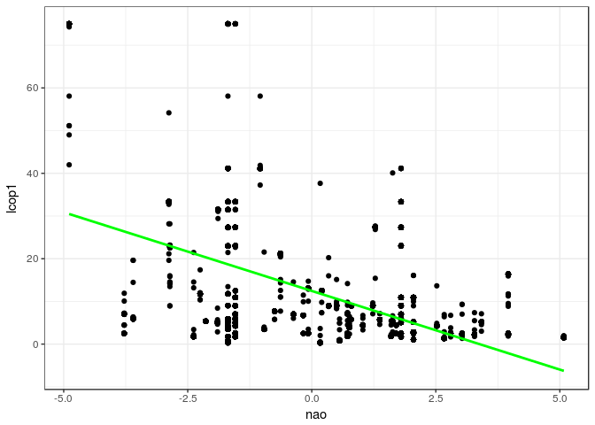
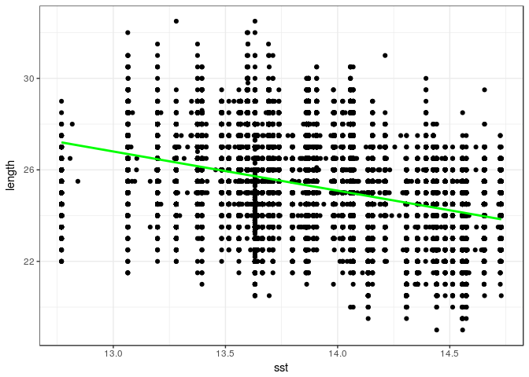
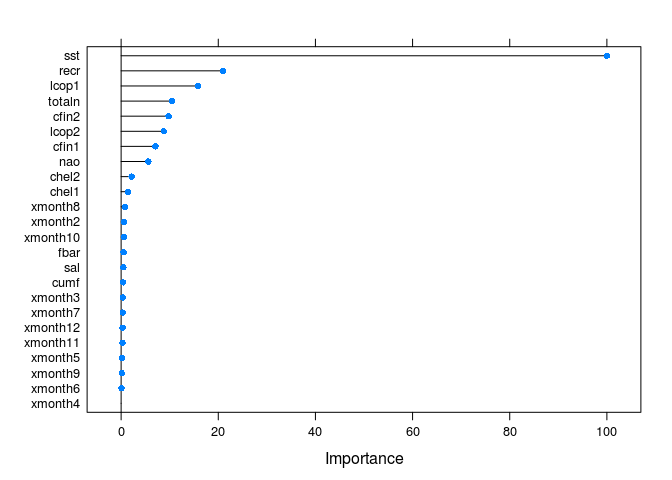

# Raport - analiza rozmarów śledzi
Martin Berent  
\`r format(Sys.Date(), "%d %B, %Y")`\  


<br>

### Dane
#### Atrybuty:

* **length:** długość złowionego śledzia [cm]
* **cfin1:** dostępność planktonu [zagęszczenie Calanus finmarchicus gat. 1]
* **cfin2:** dostępność planktonu [zagęszczenie Calanus finmarchicus gat. 2]
* **chel1:** *dostępność planktonu [zagęszczenie Calanus helgolandicus gat. 1]
* **chel2:** dostępność planktonu [zagęszczenie Calanus helgolandicus gat. 2]
* **lcop1:** dostępność planktonu [zagęszczenie widłonogów gat. 1]
* **lcop2:** dostępność planktonu [zagęszczenie widłonogów gat. 2]
* **fbar:** natężenie połowów w regionie [ułamek pozostawionego narybku]
* **recr:** roczny narybek [liczba śledzi]
* **cumf:** łączne roczne natężenie połowów w regionie [ułamek pozostawionego narybku]
* **totaln:** łączna liczba ryb złowionych w ramach połowu [liczba śledzi]
* **sst:** temperatura przy powierzchni wody [°C]
* **sal:** poziom zasolenia wody [Knudsen ppt]
* **xmonth:** miesiąc połowu [numer miesiąca]
* **nao:** oscylacja północnoatlantycka [mb]
<br><br>

#### Pierwszych pięć obserwacji:


```r
data <- read.csv("sledzie.csv", header = TRUE, sep = ",", na.strings = "?", nrows=52581)
data$xmonth <- factor(data$xmonth, sort(as.numeric(unique(data$xmonth))))
data <- data %>% rename(fishing = X)
pander(head(data))
```


|  fishing  |  length  |  cfin1  |  cfin2  |  chel1  |  chel2  |  lcop1  |  lcop2  |  fbar  |  recr  |  cumf  |  totaln  |  sst  |  sal  |  xmonth  |  nao  |
|:---------:|:--------:|:-------:|:-------:|:-------:|:-------:|:-------:|:-------:|:------:|:------:|:------:|:--------:|:-----:|:-----:|:--------:|:-----:|
|     0     |    23    | 0.02778 | 0.2778  |  2.469  |   NA    |  2.548  |  26.36  | 0.356  | 482831 | 0.306  |  267381  | 14.31 | 35.51 |    7     |  2.8  |
|     1     |   22.5   | 0.02778 | 0.2778  |  2.469  |  21.44  |  2.548  |  26.36  | 0.356  | 482831 | 0.306  |  267381  | 14.31 | 35.51 |    7     |  2.8  |
|     2     |    25    | 0.02778 | 0.2778  |  2.469  |  21.44  |  2.548  |  26.36  | 0.356  | 482831 | 0.306  |  267381  | 14.31 | 35.51 |    7     |  2.8  |
|     3     |   25.5   | 0.02778 | 0.2778  |  2.469  |  21.44  |  2.548  |  26.36  | 0.356  | 482831 | 0.306  |  267381  | 14.31 | 35.51 |    7     |  2.8  |
|     4     |    24    | 0.02778 | 0.2778  |  2.469  |  21.44  |  2.548  |  26.36  | 0.356  | 482831 | 0.306  |  267381  | 14.31 | 35.51 |    7     |  2.8  |
|     5     |    22    | 0.02778 | 0.2778  |  2.469  |  21.44  |  2.548  |   NA    | 0.356  | 482831 | 0.306  |  267381  | 14.31 | 35.51 |    7     |  2.8  |

<br>

### Podstawowe statystyki
#### Podsumowanie cech

```r
sprintf("Liczba kolumn %d", ncol(data))
```

```
## [1] "Liczba kolumn 16"
```

```r
sprintf("Liczba wierszy %d", nrow(data))
```

```
## [1] "Liczba wierszy 52581"
```

```r
sprintf("Liczba wierszy nie zawierających wartość pustą %d", nrow(na.omit(data)))
```

```
## [1] "Liczba wierszy nie zawierających wartość pustą 42488"
```

```r
pander(summary(data))
```


|    fishing    |    length    |      cfin1      |      cfin2      |     chel1      |     chel2      |      lcop1       |     lcop2      |      fbar      |
|:-------------:|:------------:|:---------------:|:---------------:|:--------------:|:--------------:|:----------------:|:--------------:|:--------------:|
| Min.   :    0 | Min.   :19.0 | Min.   : 0.0000 | Min.   : 0.0000 | Min.   : 0.000 | Min.   : 5.238 | Min.   :  0.3074 | Min.   : 7.849 | Min.   :0.0680 |
| 1st Qu.:13145 | 1st Qu.:24.0 | 1st Qu.: 0.0000 | 1st Qu.: 0.2778 | 1st Qu.: 2.469 | 1st Qu.:13.427 | 1st Qu.:  2.5479 | 1st Qu.:17.808 | 1st Qu.:0.2270 |
| Median :26290 | Median :25.5 | Median : 0.1111 | Median : 0.7012 | Median : 5.750 | Median :21.673 | Median :  7.0000 | Median :24.859 | Median :0.3320 |
| Mean   :26290 | Mean   :25.3 | Mean   : 0.4458 | Mean   : 2.0248 | Mean   :10.006 | Mean   :21.221 | Mean   : 12.8108 | Mean   :28.419 | Mean   :0.3303 |
| 3rd Qu.:39435 | 3rd Qu.:26.5 | 3rd Qu.: 0.3333 | 3rd Qu.: 1.7936 | 3rd Qu.:11.500 | 3rd Qu.:27.193 | 3rd Qu.: 21.2315 | 3rd Qu.:37.232 | 3rd Qu.:0.4560 |
| Max.   :52580 | Max.   :32.5 | Max.   :37.6667 | Max.   :19.3958 | Max.   :75.000 | Max.   :57.706 | Max.   :115.5833 | Max.   :68.736 | Max.   :0.8490 |
|      NA       |      NA      |  NA's   :1581   |  NA's   :1536   |  NA's   :1555  |  NA's   :1556  |   NA's   :1652   |  NA's   :1591  |       NA       |

Table: Table continues below

 

|      recr       |      cumf       |     totaln      |      sst      |      sal      |    xmonth     |       nao        |
|:---------------:|:---------------:|:---------------:|:-------------:|:-------------:|:-------------:|:----------------:|
| Min.   : 140515 | Min.   :0.06833 | Min.   : 144137 | Min.   :12.77 | Min.   :35.40 | 8      : 9920 | Min.   :-4.89000 |
| 1st Qu.: 360061 | 1st Qu.:0.14809 | 1st Qu.: 306068 | 1st Qu.:13.60 | 1st Qu.:35.51 | 10     : 7972 | 1st Qu.:-1.89000 |
| Median : 421391 | Median :0.23191 | Median : 539558 | Median :13.86 | Median :35.51 | 7      : 6922 | Median : 0.20000 |
| Mean   : 520368 | Mean   :0.22981 | Mean   : 514979 | Mean   :13.87 | Mean   :35.51 | 9      : 5714 | Mean   :-0.09233 |
| 3rd Qu.: 724151 | 3rd Qu.:0.29803 | 3rd Qu.: 730351 | 3rd Qu.:14.16 | 3rd Qu.:35.52 | 6      : 4217 | 3rd Qu.: 1.63000 |
| Max.   :1565890 | Max.   :0.39801 | Max.   :1015595 | Max.   :14.73 | Max.   :35.61 | 5      : 3736 | Max.   : 5.08000 |
|       NA        |       NA        |       NA        | NA's   :1584  |      NA       | (Other):14100 |        NA        |

#### Rozkład wartości cech

```r
ggplot(data, aes(length)) + geom_histogram(binwidth = 0.5) + 
  theme_bw() + ggtitle('Długość złowionego śledzia')
```

<!-- -->

```r
p_cfin1 <- ggplot(data, aes(cfin1)) + geom_histogram(bins = 40) + 
  theme_bw() + ggtitle('Calanus finmarchicus gat. 1')
p_cfin2 <- ggplot(data, aes(cfin2)) + geom_histogram(bins = 40) + 
  theme_bw() + ggtitle('Calanus finmarchicus gat. 2')
grid.arrange(p_cfin1, p_cfin2, nrow=1)
```

<!-- -->

```r
p_chel1 <- ggplot(data, aes(chel1)) + geom_histogram(bins = 40) + 
  theme_bw() + ggtitle('Calanus helgolandicus gat. 1')
p_chel2 <- ggplot(data, aes(chel2)) + geom_histogram(bins = 40) + 
  theme_bw() + ggtitle('Calanus helgolandicus gat. 2')
grid.arrange(p_chel1, p_chel2, nrow=1)
```

<!-- -->

```r
p_lcop1 <- ggplot(data, aes(lcop1)) + geom_histogram(bins = 40) + 
  theme_bw() + ggtitle('Widłonogi gat. 1')
p_lcop2 <- ggplot(data, aes(lcop2)) + geom_histogram(bins = 40) + 
  theme_bw()+ ggtitle('Widłonogi gat. 2')
grid.arrange(p_lcop1, p_lcop2, nrow=1)
```

<!-- -->

```r
p_fbar <- ggplot(data, aes(fbar)) + geom_histogram(binwidth = 0.05) + 
  theme_bw() + ggtitle('Natężenie połowów w regionie')
p_cumf <- ggplot(data, aes(cumf)) + geom_histogram(binwidth = 0.02) + 
  theme_bw() + ggtitle('Roczne natężenie połowów\nw regionie')
p_recr <- ggplot(data, aes(recr)) + geom_histogram() + 
  theme_bw() + ggtitle('Roczny narybek')
p_totaln <- ggplot(data, aes(totaln)) + geom_histogram(binwidth = 50000) + 
  theme_bw() + ggtitle('Liczba złowionych ryb')
grid.arrange(p_fbar, p_cumf, p_recr, p_totaln, nrow=2)
```

<!-- -->

```r
p_sst <- ggplot(data, aes(sst)) + geom_histogram() + 
  theme_bw() + ggtitle('Temp. przy powierzchni wody')
p_sal <- ggplot(data, aes(sal)) + geom_histogram() + 
  theme_bw() + ggtitle('Poziom zasolenia wody')
grid.arrange(p_sst, p_sal, nrow=1)
```

<!-- -->

```r
p_xmonth <- ggplot(data, aes(xmonth)) + geom_bar(stat = 'count') + 
  theme_bw() + ggtitle('Miesiąc połowu')
p_nao <- ggplot(data, aes(nao)) + geom_histogram(binwidth = 0.3) + 
  theme_bw() + ggtitle('Oscylacja północnoatlantycka')
grid.arrange(p_xmonth, p_nao, nrow=1)
```

<!-- -->

### Wartości odstające

Na podstawie wykresów obrazujących rozkład wartości można wnioskować że dla atrybutów *cfin1* oraz *lcop1* występują wartości odstające.


```r
pander(data %>% filter(cfin1 > 10 | lcop1 > 90))
```


|  fishing  |  length  |  cfin1  |  cfin2  |  chel1  |  chel2  |  lcop1  |  lcop2  |  fbar  |  recr   |  cumf   |  totaln  |  sst  |  sal  |  xmonth  |  nao  |
|:---------:|:--------:|:-------:|:-------:|:-------:|:-------:|:-------:|:-------:|:------:|:-------:|:-------:|:--------:|:-----:|:-----:|:--------:|:-----:|
|   52496   |    28    |  37.67  |  10.17  |  64.75  |  43.64  |  115.6  |  59.09  | 0.125  | 1565890 | 0.09586 |  727441  | 13.62 | 35.53 |    9     | -1.02 |
|   52497   |   24.5   |  37.67  |  10.17  |  64.75  |  43.64  |  115.6  |  59.09  | 0.125  | 1565890 | 0.09586 |  727441  | 13.62 | 35.53 |    9     | -1.02 |
|   52498   |    27    |  37.67  |  10.17  |  64.75  |  43.64  |  115.6  |  59.09  | 0.125  | 1565890 | 0.09586 |  727441  | 13.62 | 35.53 |    9     | -1.02 |
|   52499   |    26    |  37.67  |  10.17  |  64.75  |  43.64  |  115.6  |  59.09  | 0.125  | 1565890 | 0.09586 |  727441  | 13.62 | 35.53 |    9     | -1.02 |
|   52500   |   25.5   |  37.67  |  10.17  |  64.75  |  43.64  |  115.6  |  59.09  | 0.125  | 1565890 | 0.09586 |  727441  | 13.62 | 35.53 |    9     | -1.02 |
|   52501   |   24.5   |  37.67  |  10.17  |  64.75  |  43.64  |  115.6  |  59.09  | 0.125  | 1565890 | 0.09586 |  727441  | 13.62 | 35.53 |    9     | -1.02 |

Powyższe obserwacje zostaną usunięte ze zbioru danych. Poniżej rozkład wartości bez wartości odstających.


```r
data <- data %>% filter(cfin1 <= 10 | is.na(cfin1)) %>% filter(lcop1 <= 90 | is.na(lcop1))

p_cfin1 <- ggplot(data, aes(cfin1)) + geom_histogram(bins = 40) + 
  theme_bw() + ggtitle('Calanus finmarchicus gat. 1')
p_lcop1 <- ggplot(data, aes(lcop1)) + geom_histogram(bins = 40) + 
  theme_bw() + ggtitle('Widłonogi gat. 1')

grid.arrange(p_cfin1, p_lcop1, nrow=1)
```

<!-- -->

### Wartości puste

Kolumny zawierające wartości puste


```r
colnames(data)[apply(is.na(data), 2, any)]
```

```
## [1] "cfin1" "cfin2" "chel1" "chel2" "lcop1" "lcop2" "sst"
```

#### cfin1


```r
statsNA(data$cfin1, bins = 10)
```

```
## [1] "Length of time series:"
## [1] 52575
## [1] "-------------------------"
## [1] "Number of Missing Values:"
## [1] 1581
## [1] "-------------------------"
## [1] "Percentage of Missing Values:"
## [1] "3.01%"
## [1] "-------------------------"
## [1] "Stats for Bins"
## [1] "  Bin 1 (5258 values from 1 to 5258) :      159 NAs (3.02%)"
## [1] "  Bin 2 (5258 values from 5259 to 10516) :      144 NAs (2.74%)"
## [1] "  Bin 3 (5258 values from 10517 to 15774) :      172 NAs (3.27%)"
## [1] "  Bin 4 (5258 values from 15775 to 21032) :      168 NAs (3.2%)"
## [1] "  Bin 5 (5258 values from 21033 to 26290) :      153 NAs (2.91%)"
## [1] "  Bin 6 (5258 values from 26291 to 31548) :      141 NAs (2.68%)"
## [1] "  Bin 7 (5258 values from 31549 to 36806) :      181 NAs (3.44%)"
## [1] "  Bin 8 (5258 values from 36807 to 42064) :      150 NAs (2.85%)"
## [1] "  Bin 9 (5258 values from 42065 to 47322) :      156 NAs (2.97%)"
## [1] "  Bin 10 (5253 values from 47323 to 52575) :      157 NAs (2.99%)"
## [1] "-------------------------"
## [1] "Longest NA gap (series of consecutive NAs)"
## [1] "3 in a row"
## [1] "-------------------------"
## [1] "Most frequent gap size (series of consecutive NA series)"
## [1] "1 NA in a row (occuring 1480 times)"
## [1] "-------------------------"
## [1] "Gap size accounting for most NAs"
## [1] "1 NA in a row (occuring 1480 times, making up for overall 1480 NAs)"
## [1] "-------------------------"
## [1] "Overview NA series"
## [1] "  1 NA in a row: 1480 times"
## [1] "  2 NA in a row: 49 times"
## [1] "  3 NA in a row: 1 times"
```

#### cfin2


```r
statsNA(data$cfin2, bins = 10)
```

```
## [1] "Length of time series:"
## [1] 52575
## [1] "-------------------------"
## [1] "Number of Missing Values:"
## [1] 1536
## [1] "-------------------------"
## [1] "Percentage of Missing Values:"
## [1] "2.92%"
## [1] "-------------------------"
## [1] "Stats for Bins"
## [1] "  Bin 1 (5258 values from 1 to 5258) :      162 NAs (3.08%)"
## [1] "  Bin 2 (5258 values from 5259 to 10516) :      150 NAs (2.85%)"
## [1] "  Bin 3 (5258 values from 10517 to 15774) :      157 NAs (2.99%)"
## [1] "  Bin 4 (5258 values from 15775 to 21032) :      134 NAs (2.55%)"
## [1] "  Bin 5 (5258 values from 21033 to 26290) :      154 NAs (2.93%)"
## [1] "  Bin 6 (5258 values from 26291 to 31548) :      148 NAs (2.81%)"
## [1] "  Bin 7 (5258 values from 31549 to 36806) :      169 NAs (3.21%)"
## [1] "  Bin 8 (5258 values from 36807 to 42064) :      152 NAs (2.89%)"
## [1] "  Bin 9 (5258 values from 42065 to 47322) :      163 NAs (3.1%)"
## [1] "  Bin 10 (5253 values from 47323 to 52575) :      147 NAs (2.8%)"
## [1] "-------------------------"
## [1] "Longest NA gap (series of consecutive NAs)"
## [1] "3 in a row"
## [1] "-------------------------"
## [1] "Most frequent gap size (series of consecutive NA series)"
## [1] "1 NA in a row (occuring 1461 times)"
## [1] "-------------------------"
## [1] "Gap size accounting for most NAs"
## [1] "1 NA in a row (occuring 1461 times, making up for overall 1461 NAs)"
## [1] "-------------------------"
## [1] "Overview NA series"
## [1] "  1 NA in a row: 1461 times"
## [1] "  2 NA in a row: 36 times"
## [1] "  3 NA in a row: 1 times"
```

#### chel1


```r
statsNA(data$chel1, bins = 10)
```

```
## [1] "Length of time series:"
## [1] 52575
## [1] "-------------------------"
## [1] "Number of Missing Values:"
## [1] 1555
## [1] "-------------------------"
## [1] "Percentage of Missing Values:"
## [1] "2.96%"
## [1] "-------------------------"
## [1] "Stats for Bins"
## [1] "  Bin 1 (5258 values from 1 to 5258) :      138 NAs (2.62%)"
## [1] "  Bin 2 (5258 values from 5259 to 10516) :      158 NAs (3%)"
## [1] "  Bin 3 (5258 values from 10517 to 15774) :      168 NAs (3.2%)"
## [1] "  Bin 4 (5258 values from 15775 to 21032) :      173 NAs (3.29%)"
## [1] "  Bin 5 (5258 values from 21033 to 26290) :      143 NAs (2.72%)"
## [1] "  Bin 6 (5258 values from 26291 to 31548) :      150 NAs (2.85%)"
## [1] "  Bin 7 (5258 values from 31549 to 36806) :      162 NAs (3.08%)"
## [1] "  Bin 8 (5258 values from 36807 to 42064) :      154 NAs (2.93%)"
## [1] "  Bin 9 (5258 values from 42065 to 47322) :      147 NAs (2.8%)"
## [1] "  Bin 10 (5253 values from 47323 to 52575) :      162 NAs (3.08%)"
## [1] "-------------------------"
## [1] "Longest NA gap (series of consecutive NAs)"
## [1] "3 in a row"
## [1] "-------------------------"
## [1] "Most frequent gap size (series of consecutive NA series)"
## [1] "1 NA in a row (occuring 1471 times)"
## [1] "-------------------------"
## [1] "Gap size accounting for most NAs"
## [1] "1 NA in a row (occuring 1471 times, making up for overall 1471 NAs)"
## [1] "-------------------------"
## [1] "Overview NA series"
## [1] "  1 NA in a row: 1471 times"
## [1] "  2 NA in a row: 39 times"
## [1] "  3 NA in a row: 2 times"
```

#### chel2


```r
statsNA(data$chel2, bins = 10)
```

```
## [1] "Length of time series:"
## [1] 52575
## [1] "-------------------------"
## [1] "Number of Missing Values:"
## [1] 1556
## [1] "-------------------------"
## [1] "Percentage of Missing Values:"
## [1] "2.96%"
## [1] "-------------------------"
## [1] "Stats for Bins"
## [1] "  Bin 1 (5258 values from 1 to 5258) :      159 NAs (3.02%)"
## [1] "  Bin 2 (5258 values from 5259 to 10516) :      161 NAs (3.06%)"
## [1] "  Bin 3 (5258 values from 10517 to 15774) :      158 NAs (3%)"
## [1] "  Bin 4 (5258 values from 15775 to 21032) :      173 NAs (3.29%)"
## [1] "  Bin 5 (5258 values from 21033 to 26290) :      151 NAs (2.87%)"
## [1] "  Bin 6 (5258 values from 26291 to 31548) :      149 NAs (2.83%)"
## [1] "  Bin 7 (5258 values from 31549 to 36806) :      168 NAs (3.2%)"
## [1] "  Bin 8 (5258 values from 36807 to 42064) :      133 NAs (2.53%)"
## [1] "  Bin 9 (5258 values from 42065 to 47322) :      146 NAs (2.78%)"
## [1] "  Bin 10 (5253 values from 47323 to 52575) :      158 NAs (3.01%)"
## [1] "-------------------------"
## [1] "Longest NA gap (series of consecutive NAs)"
## [1] "3 in a row"
## [1] "-------------------------"
## [1] "Most frequent gap size (series of consecutive NA series)"
## [1] "1 NA in a row (occuring 1448 times)"
## [1] "-------------------------"
## [1] "Gap size accounting for most NAs"
## [1] "1 NA in a row (occuring 1448 times, making up for overall 1448 NAs)"
## [1] "-------------------------"
## [1] "Overview NA series"
## [1] "  1 NA in a row: 1448 times"
## [1] "  2 NA in a row: 51 times"
## [1] "  3 NA in a row: 2 times"
```

#### lcop1


```r
statsNA(data$lcop1, bins = 10)
```

```
## [1] "Length of time series:"
## [1] 52575
## [1] "-------------------------"
## [1] "Number of Missing Values:"
## [1] 1652
## [1] "-------------------------"
## [1] "Percentage of Missing Values:"
## [1] "3.14%"
## [1] "-------------------------"
## [1] "Stats for Bins"
## [1] "  Bin 1 (5258 values from 1 to 5258) :      177 NAs (3.37%)"
## [1] "  Bin 2 (5258 values from 5259 to 10516) :      189 NAs (3.59%)"
## [1] "  Bin 3 (5258 values from 10517 to 15774) :      144 NAs (2.74%)"
## [1] "  Bin 4 (5258 values from 15775 to 21032) :      148 NAs (2.81%)"
## [1] "  Bin 5 (5258 values from 21033 to 26290) :      160 NAs (3.04%)"
## [1] "  Bin 6 (5258 values from 26291 to 31548) :      177 NAs (3.37%)"
## [1] "  Bin 7 (5258 values from 31549 to 36806) :      163 NAs (3.1%)"
## [1] "  Bin 8 (5258 values from 36807 to 42064) :      149 NAs (2.83%)"
## [1] "  Bin 9 (5258 values from 42065 to 47322) :      178 NAs (3.39%)"
## [1] "  Bin 10 (5253 values from 47323 to 52575) :      167 NAs (3.18%)"
## [1] "-------------------------"
## [1] "Longest NA gap (series of consecutive NAs)"
## [1] "2 in a row"
## [1] "-------------------------"
## [1] "Most frequent gap size (series of consecutive NA series)"
## [1] "1 NA in a row (occuring 1550 times)"
## [1] "-------------------------"
## [1] "Gap size accounting for most NAs"
## [1] "1 NA in a row (occuring 1550 times, making up for overall 1550 NAs)"
## [1] "-------------------------"
## [1] "Overview NA series"
## [1] "  1 NA in a row: 1550 times"
## [1] "  2 NA in a row: 51 times"
```

#### lcop2


```r
statsNA(data$lcop2, bins = 10)
```

```
## [1] "Length of time series:"
## [1] 52575
## [1] "-------------------------"
## [1] "Number of Missing Values:"
## [1] 1591
## [1] "-------------------------"
## [1] "Percentage of Missing Values:"
## [1] "3.03%"
## [1] "-------------------------"
## [1] "Stats for Bins"
## [1] "  Bin 1 (5258 values from 1 to 5258) :      154 NAs (2.93%)"
## [1] "  Bin 2 (5258 values from 5259 to 10516) :      165 NAs (3.14%)"
## [1] "  Bin 3 (5258 values from 10517 to 15774) :      181 NAs (3.44%)"
## [1] "  Bin 4 (5258 values from 15775 to 21032) :      162 NAs (3.08%)"
## [1] "  Bin 5 (5258 values from 21033 to 26290) :      147 NAs (2.8%)"
## [1] "  Bin 6 (5258 values from 26291 to 31548) :      151 NAs (2.87%)"
## [1] "  Bin 7 (5258 values from 31549 to 36806) :      145 NAs (2.76%)"
## [1] "  Bin 8 (5258 values from 36807 to 42064) :      157 NAs (2.99%)"
## [1] "  Bin 9 (5258 values from 42065 to 47322) :      177 NAs (3.37%)"
## [1] "  Bin 10 (5253 values from 47323 to 52575) :      152 NAs (2.89%)"
## [1] "-------------------------"
## [1] "Longest NA gap (series of consecutive NAs)"
## [1] "3 in a row"
## [1] "-------------------------"
## [1] "Most frequent gap size (series of consecutive NA series)"
## [1] "1 NA in a row (occuring 1503 times)"
## [1] "-------------------------"
## [1] "Gap size accounting for most NAs"
## [1] "1 NA in a row (occuring 1503 times, making up for overall 1503 NAs)"
## [1] "-------------------------"
## [1] "Overview NA series"
## [1] "  1 NA in a row: 1503 times"
## [1] "  2 NA in a row: 41 times"
## [1] "  3 NA in a row: 2 times"
```

#### sst


```r
statsNA(data$sst, bins = 10)
```

```
## [1] "Length of time series:"
## [1] 52575
## [1] "-------------------------"
## [1] "Number of Missing Values:"
## [1] 1584
## [1] "-------------------------"
## [1] "Percentage of Missing Values:"
## [1] "3.01%"
## [1] "-------------------------"
## [1] "Stats for Bins"
## [1] "  Bin 1 (5258 values from 1 to 5258) :      162 NAs (3.08%)"
## [1] "  Bin 2 (5258 values from 5259 to 10516) :      159 NAs (3.02%)"
## [1] "  Bin 3 (5258 values from 10517 to 15774) :      153 NAs (2.91%)"
## [1] "  Bin 4 (5258 values from 15775 to 21032) :      160 NAs (3.04%)"
## [1] "  Bin 5 (5258 values from 21033 to 26290) :      141 NAs (2.68%)"
## [1] "  Bin 6 (5258 values from 26291 to 31548) :      157 NAs (2.99%)"
## [1] "  Bin 7 (5258 values from 31549 to 36806) :      160 NAs (3.04%)"
## [1] "  Bin 8 (5258 values from 36807 to 42064) :      150 NAs (2.85%)"
## [1] "  Bin 9 (5258 values from 42065 to 47322) :      183 NAs (3.48%)"
## [1] "  Bin 10 (5253 values from 47323 to 52575) :      159 NAs (3.03%)"
## [1] "-------------------------"
## [1] "Longest NA gap (series of consecutive NAs)"
## [1] "3 in a row"
## [1] "-------------------------"
## [1] "Most frequent gap size (series of consecutive NA series)"
## [1] "1 NA in a row (occuring 1501 times)"
## [1] "-------------------------"
## [1] "Gap size accounting for most NAs"
## [1] "1 NA in a row (occuring 1501 times, making up for overall 1501 NAs)"
## [1] "-------------------------"
## [1] "Overview NA series"
## [1] "  1 NA in a row: 1501 times"
## [1] "  2 NA in a row: 40 times"
## [1] "  3 NA in a row: 1 times"
```

#### Wypełniane 

Dla wszystkich powyższych atrubutów wartości puste stanowią mniej niż 5% obserwacji. Ich rokład jest równomierny i ma charakter losowy. Sekwencje dwóch lub trzech wartości pustych są rzadkie. W związku z tym wartości puste będą imputowane z użyciem filtru Kalmana.   


```r
data$cfin1 <- na.kalman(data$cfin1)
data$cfin2 <- na.kalman(data$cfin2)
data$chel1 <- na.kalman(data$chel1)
data$chel2 <- na.kalman(data$chel2)
data$lcop1 <- na.kalman(data$lcop1)
data$lcop2 <- na.kalman(data$lcop2)
data$sst <- na.kalman(data$sst)
```

### Korelacja

Do przygotowania wykresu nie użyto kolumny identyfikującej połów oraz kolumny określającej miesiąc połowu.


```r
M<-cor(data[, -c(1,15)])
corrplot(M, method="circle")
```

<!-- -->


```r
data_sample <- data
ggplot(data_sample, aes(nao, lcop1)) + 
  geom_point() + 
  geom_smooth(color="green", method="lm") + 
  theme_bw()
```

<!-- -->


```r
data_sample <- data
ggplot(data_sample, aes(nao, chel1)) + 
  geom_point() + 
  geom_smooth(color="green", method="lm") + 
  theme_bw()
```

<!-- -->


```r
data_sample <- data
ggplot(data_sample, aes(sst, length)) + 
  geom_point() + 
  geom_smooth(color="green", method="lm") + 
  theme_bw()
```

<!-- -->

### Zmienność cech w kolejnych połowach 

Szarą przerywaną linią oznaczono połów rozpoczynający zmianę trendu długości złowionego śledzia 


```r
data_sample <- sample_n(data, 500)
q <- ggplot(data_sample, aes(fishing, length)) + 
  geom_jitter() + 
  geom_smooth(se = FALSE, color="green") + 
  geom_vline(xintercept = 17000, colour="darkgray", linetype = "longdash", size=1) + 
  ggtitle('Zmiana długości złowionego śledzia') +
  theme_bw()
ggplotly(q)
```

<!--html_preserve--><div id="htmlwidget-0df406eb5db29148026b" style="width:672px;height:480px;" class="plotly html-widget"></div>
<script type="application/json" data-for="htmlwidget-0df406eb5db29148026b">{"x":{"data":[{"x":[48094.7092041666,49264.7417091291,15043.0156483604,43658.2488966281,33736.69228961,27288.3147374293,38721.0602823049,7078.71725791544,34536.3222446371,37061.8024019755,24060.7204780802,37799.2148377279,49128.7840986649,13424.8443194624,24298.0148556897,49406.8676797334,51413.7235479746,6173.81309565492,24963.8806036934,29448.062766703,47511.2468814362,7289.34661625195,51969.26709067,49748.7016022196,4332.11956316121,27021.1522813261,20503.6256358596,47594.3363913199,23485.9827751096,43927.8132164627,38756.285208573,42615.7833171822,20392.2335574986,36000.1174198883,206.939467752539,43760.6760546144,384.602774163149,10909.0249069352,47630.0194456927,32139.7705484437,19940.173545664,22892.369074861,1966.0146132797,51140.7396224178,22680.0500321079,50301.2074065357,46632.13357707,33615.7798983386,51000.87667981,32504.8558654079,17513.3239187181,18211.7593587041,20929.1447704133,41212.7100142069,2043.6855957495,39325.6742875166,35569.3331591642,8993.82164834868,13711.3086351018,27014.2182917196,35479.2360409889,51610.7645388745,39884.6385546584,29746.6310527449,44617.8276593039,9948.87904786598,14244.1899626603,43483.801330865,36398.0139496025,12630.2075557781,2257.10886762235,7374.7631525483,11360.3944362257,25168.6003240347,10363.7652560201,37766.1072224725,412.613833460212,19711.6213883771,27004.0862724761,82.0564330821857,30530.7966826783,8289.33562006913,18846.1377729613,33890.1163603514,40722.7666283637,29584.9844941886,12266.3892148666,4722.39449587818,4492.96061922926,16019.1718790289,35028.85324929,12.2669500485063,10945.9471804652,48967.3967938066,48578.2446489707,38524.9889937339,17479.0310176007,27028.8728319267,39040.6416124836,32490.9669784905,32861.9985252723,11394.8262113802,11363.2211560659,20407.8430822095,49451.0124409456,50507.9823606186,38819.2150817797,38470.7311430845,28108.9534193199,119.01872613579,31946.9815353509,43901.0197146302,39427.1481825978,23750.8814336177,28108.2717050282,28190.3375309532,71.6850476970896,18656.7652231345,32109.9893143294,43481.859057619,18710.97737114,21539.0688708017,30079.7791600101,30929.1872237761,37745.7203872792,20716.1580426935,48210.8112863239,50483.9411719378,12247.1770668587,37996.9795773657,47390.8708695687,31647.7924737111,33117.7730077423,49157.7936464952,44600.0519237384,30405.1700544711,43072.6864772784,5963.01526069883,40088.2817522757,32699.1717055537,7782.85118534788,4207.69265371393,24332.060003254,40863.2650975376,38459.0162718063,42847.1552088229,8920.99992319159,49528.883328319,15393.3718433272,7815.33780900333,37712.7636741653,16989.3639223462,40827.2991942659,20677.1578758651,35572.0100750279,40667.9846532123,9846.76144073848,1523.68018348347,7112.97807109971,35650.8497437185,48998.2179194441,28853.3208592011,31539.8681834273,10324.2591553971,28051.7760262879,9410.2128989907,23682.0485662809,16615.9387644302,6088.27085583061,9751.82985647004,38240.9765765605,21583.2246756267,21696.6661734698,52506.9156140402,22400.6765291259,7151.70666658878,43211.7769009424,31034.8192956328,41623.8392473998,40293.899829418,48100.993161994,45196.3028820988,16607.198983863,13583.3641488185,38887.8655361705,39154.2593302371,48087.7061323067,41552.699757483,6984.18248776943,15074.0387366628,10198.0868139302,41073.6983573604,6750.30114775915,6761.27387905251,3783.63699025083,2782.16561466288,27859.0278328441,5882.35636578724,38925.3296239832,38302.9647828132,46358.2124163829,27083.0040356636,52515.7620387863,23190.1737109778,8268.21446157154,23164.1651016362,50678.7532993089,25375.8383198408,13219.8601050131,13598.0575009879,28382.3059932204,34030.3016827011,17614.9086820297,3191.19021772388,23631.2370554913,43917.1793291686,30086.9083508711,18499.8385218261,28660.6459769219,46739.1389543714,25652.7583935415,8985.10008631926,28428.7105462724,50333.8984628165,16420.8512718663,42953.2521479199,16072.8946544776,9707.95171530098,2529.95124642197,12860.0814626286,18377.923125549,8323.36665462479,15917.3766143709,918.331622418575,52159.6662989667,42100.9814876888,4530.87130821273,45530.1387486512,29025.1091887562,22053.2874224916,3539.35862753987,29382.0591736527,3701.02821524441,11062.3533555543,28762.3138841217,25221.928245071,8343.64002459794,7827.22261543572,26125.3407691117,49214.9019817663,17487.7959367957,9858.67010872681,14111.9128867975,27768.7460491402,1121.70689982772,41790.8059703307,5772.04259763826,28240.7184554212,29885.3703174593,32381.3556183031,37397.3938286353,6450.16496845651,16270.7126226846,49472.6071860993,26156.1491964309,7073.1449745534,45470.334008706,10724.9267369714,48385.9379515121,46382.0298560655,7127.93091717046,41075.6781157268,23708.9042141123,7098.75840046201,46297.1800193811,17609.6088072328,16697.335086208,21117.3201829873,25054.2033230916,19239.361537452,24353.1004696738,2609.1247604169,9796.90510049406,51384.6524845082,17165.1527046803,8940.70198709387,25529.8330548149,977.105776712671,17749.9120191982,1549.65634052791,45343.2908583447,38255.9081521656,16482.136608107,20203.6169570418,17380.0761830086,4692.82099292893,39577.919301524,31520.7166523436,7601.25926538277,1698.71232790612,25288.3272380121,23239.3199398492,3155.75387940314,17119.025832211,45916.0176997924,48641.7282685848,20498.0156536141,8301.77960280739,16721.8252095923,16043.0029500639,5633.72716851905,51183.3365045914,25968.9992235677,4864.09227526169,11067.1951447016,48627.0934545686,15512.3441128368,34134.6643027728,47086.6224969529,51775.033222775,22486.7929620551,20576.1158700176,7414.90218943935,14619.6374829493,29511.6385123994,48861.3702741539,18725.7811734004,43992.6091148557,37742.7747805106,39221.6447500549,48272.7879777174,123.922157016024,8380.61144354884,20857.8894105347,35279.0675997918,25094.0846349906,27885.8109748906,16556.1401189417,42560.3486449728,15263.6028731251,21371.2295769399,4749.24554651752,41712.6584307076,18792.0535994429,2114.03135267682,2144.71014012415,49848.8210661191,19497.8814748054,42116.2502441891,47527.7372330785,22982.0169296741,30098.2116982739,3846.8310045179,8596.94942265283,38637.1355606062,24840.6295390258,35797.0485170793,49686.3459065897,25975.9476979936,24567.3489860935,29250.3826421024,34070.1414098309,14596.8386151163,51161.7666027157,52532.8551171431,30416.2834999748,32153.6488479255,48298.7456368845,20360.9870692808,15030.8706268594,4736.25069015846,16811.296345984,39582.6153290231,5450.25979854576,37076.9210147962,50450.1376466306,10516.6949377725,5661.98113947157,2891.340271971,43308.0598714733,30335.3302012637,24536.2042415394,19051.1047999393,52251.2355365204,31299.3388371699,42720.7315750478,5104.7543071555,50292.6781141324,8805.26328751631,4492.24469116628,44941.8234159891,27384.9592236632,34274.1007029658,11975.896737133,37633.9058551587,25607.3315847011,50365.9122382037,47321.6562350076,52330.1660052886,3944.15439745113,1183.67691783216,26776.6295225836,32905.9207520967,21847.6092297802,45872.0543128127,5633.3559599407,51139.8746417418,13821.7955986239,4396.03334158193,20130.6941635024,6514.89992676415,30335.8620088935,12526.357764601,37655.3284599299,7611.20995577239,7972.20645993296,13520.3987926675,40572.0643211238,22242.7706273451,3130.70684151873,5989.23382585291,25177.3855246698,51066.385639034,42321.7003547801,28313.0946281152,3773.28654944338,24325.7115100287,17724.8932644172,35976.7257041818,26810.9582718674,26849.9886996634,28445.3601624323,23331.3238031041,4373.35213176142,48498.2187945893,856.673768788576,21589.6129947437,11833.8668076696,5193.79348247386,52153.2336565746,33893.9971096301,48032.0111032722,18902.6579215029,44578.8761112798,15686.205059953,24273.9080952365,7439.60553683192,42104.1747513842,34706.0455754658,3227.65606610123,22460.8782532249,20684.9304044437,36326.8493241591,34365.1900543746,21230.9106722271,15996.0955394225,13295.0988330143,35052.2419298649,46613.1232543498,44076.1435624944,20475.9286038587,4119.130602514,43170.6216942221,3798.25274317171,5979.66003422327,33349.3207722338,16703.6566617878,9834.75289870668,20521.2215433985,44915.7625068029,18126.9230116084,73.9569445025176,47480.085036375,49586.0611565942,25576.6476054132,24155.746132068,31074.8368973294,47202.900863269,9012.17047675345,40940.7001188688,12133.9433867481,30059.6243016308,43802.9633349355,6886.23544650171,46666.977021197,23446.7891116885,46574.3096280133,12945.7007622281,4358.81544911917,2533.3059665177,51033.2004158575,25216.6781543532,44030.2524536127,21681.2867144231,25484.6937258398,9544.70991772991,39536.038605598,15890.6472237201,8627.99641863294,1707.60593401846],"y":[24.1393172889948,24.8250985327177,25.6279380350374,24.5157441176474,22.9996080395766,22.808890928328,24.0216372538358,26.087959041167,24.3942860917188,25.6247518724762,23.4685895588249,25.5259642203338,22.8606763138436,26.3779169742018,26.3667132145725,25.1340438288636,24.3444313596934,25.907228042651,24.6193923881277,24.9195717632771,24.6470275009982,25.8157692988403,24.4359294040129,25.4238384381868,25.851781474147,23.4495337939821,24.9859862515703,22.3186432755552,27.1950064796954,25.163380932156,25.1917560586706,22.8681888855062,25.8170937496237,25.3571329455823,23.944232336618,24.5177682198584,24.674958647415,25.0542195463553,25.9938986126333,26.8343584910035,25.6779652748257,27.4386855087243,24.9477384893224,24.5496594971977,27.5909623301588,23.8791712435894,24.5354860800318,24.6371588667855,22.6997516129166,26.304575299751,26.1285327400081,24.8822495305911,26.3455219404772,21.5752342654392,26.9091845277697,23.1292679516599,25.0577585608698,28.0111609123647,24.8114603872411,22.9148680157028,25.3142334113829,24.159147181455,23.3523875745945,24.8205776355229,25.9455786091276,27.0781923132017,28.1569236525334,24.8977104780264,24.4567865587771,25.5480619628914,25.0257987909019,24.3165606284514,26.4896973943338,26.1796820933931,26.396132538002,26.5712566808797,26.1653728736565,26.3182326104492,24.8545708524995,23.8401416932233,26.9638618459925,23.1879791380838,26.445593860466,25.589960565418,25.0810726189986,27.30992584005,26.6783994161524,23.5133966036141,21.5785236664116,25.3181030010805,25.6666285715997,21.8131376883946,26.1109188963659,22.5104567103088,22.9064487534575,24.5019744317047,26.5129981024191,24.334748094622,25.6662405719049,25.5256033049896,24.8236922104843,27.0690902777016,26.0509290711023,26.829142167978,23.9750820216723,24.0566162983887,24.6239877948537,23.9567011888139,23.6093691224232,20.6493580500595,23.0473252465948,23.9430936736055,26.6729026724584,27.0978917184286,25.3254271966405,23.8432814030908,21.6275111566298,27.6172307752073,25.8228428144939,24.1630482470617,28.5886554454453,23.66108279787,25.0142857060768,23.9394157342613,24.1333173510619,26.1161315964535,21.5125636241399,23.6114875890315,26.3233435786329,25.4832441705279,23.308932416141,25.5959556446411,27.0822948342189,23.8022826679982,25.4883012880571,25.0384690252133,24.9135974369943,26.3220877162181,22.4511497161351,25.0120895523578,25.900391227752,24.6776345970109,23.9749953083694,26.5804267230444,23.8703391567804,23.8967899290845,26.8094732731581,23.4315084194765,25.4652365702204,25.3435018222779,25.1408209040761,25.8036239754409,22.1879054115154,25.6218586768955,24.5004158874974,22.6736716556363,28.4871408890933,26.0043907183222,24.1328887186944,26.3642598390579,24.5085446099751,26.4734266985208,25.4327272337861,26.479209500365,28.3164669441059,24.8973456203006,24.3412678623572,25.4452523791231,26.5630968130194,25.4700158628635,25.3288770381361,24.5748564765789,25.6411144112237,26.6468870211393,22.8356327437796,25.805215245299,25.4693024280481,25.6893033802509,24.4996272350661,24.6978610417806,24.9979527287185,25.3492142405361,26.5241543046199,25.3957170107402,22.0901002110913,26.1144109580666,23.4799127542414,24.9876319676638,24.4607440095395,28.1609502048232,24.525475363899,23.0763986705802,26.4329096947797,24.8379456425086,25.6751615297049,26.5684076255187,25.8059976366349,26.3452455073595,26.6391163430177,26.4787277767435,24.4607521557249,27.4728856808506,25.0654417655431,26.8729477300309,25.1353355039842,28.6669491900131,24.1193204252981,27.5012225126848,26.4017837988213,27.0668981743045,29.6764397499152,24.6923044117168,27.3209189095534,24.9529618085362,27.6224710347131,24.019155079592,26.921785808634,26.4609219306149,24.3110383145511,25.6395974748768,27.3124134810641,24.5609167326242,27.0387364419177,21.9250444152392,28.6947640401311,25.1315707756206,27.0430871720426,25.355245054327,24.6483708648942,26.03083509719,26.6196690282784,25.3112784824334,26.4025430961512,24.1027067653835,23.1319793219678,21.0094848995097,27.0551750360988,22.4951622422785,27.0327354392037,24.8401480090804,25.1366455874406,25.9609975499101,21.6090418455191,26.1805831401609,27.9061875927262,26.1317189993337,26.5614644374698,25.6194060325623,26.8744605818763,26.1018830299377,27.0943681473844,27.1007142994553,26.9330457937904,25.3230194496922,24.5697661790065,23.8166280692443,25.057425212767,24.4198418027721,24.9573724322021,27.1694017048925,25.5716871174984,24.5870185232721,27.5868546484038,23.3912688235752,25.4635095760226,27.0284455851652,23.6517800595611,28.0378712107427,24.6672580583021,23.9405534905382,24.9015953630209,24.0856446187012,27.3873881953768,25.9773462614045,25.0784850727767,28.0694016568363,26.8722156697884,26.5926980705932,25.4306251930073,26.9409698365256,25.1155972733162,26.9458148277365,24.9132643738762,22.4042478377931,25.8107679105364,25.5625170785002,29.5987119612284,24.5524582031183,26.8218072397634,27.0109139458276,24.3351089899428,24.9081150116399,28.3005090112798,27.5826057392173,27.1188321429305,23.8537171503529,26.5396521916613,25.4436854755506,26.0712258238345,27.4463720283471,29.1203546264209,26.1948121101595,23.9933042814024,28.3314805937,24.3537820226513,23.6577342391014,27.5854186332785,26.6496668966487,25.161509948317,25.9909199834801,21.326711434219,22.5879516185261,28.9087716107257,25.4306321393698,25.9540198507719,23.9322838389315,28.839432125818,23.5324715104885,23.1024768333882,26.5068016601726,24.4098103183322,24.9778471100144,24.6582425113767,26.1685130302794,27.5085345687345,24.1063451952301,27.606688608788,26.6352918794379,25.1762998760678,23.9691141800955,22.5418943556026,24.3880791291595,25.6436794841662,26.671077108942,24.533375401143,25.0635379746556,24.3261233884841,26.8978190255351,23.5035745829344,26.0059772674926,26.6054653376341,26.4071406057104,23.0750963641331,25.5230902173556,25.4723906422034,21.6443660176359,24.3446676397696,24.9265220169909,23.5963957207277,24.5186447955668,28.3718855525367,21.5726512876339,23.3421268405393,25.9154331562109,22.0896216434427,24.3181564632803,25.8435292810202,25.4670512031764,23.5386102822609,25.3788822514936,26.0004423749633,27.1298887339421,26.3368217688054,22.4881636119448,25.6523758049123,25.9742914782837,24.4106623325497,22.822853836976,25.153970448114,27.3591541756876,23.9269525934011,26.0722463936545,24.9130505370907,25.4698968450539,26.9950178587809,22.896566248592,26.4440601333976,27.8276618847623,25.444278092403,24.6931916624308,24.3760251738131,25.1487569535151,25.8450338328257,25.3776355402544,25.0920626325533,24.4080991604365,26.3840251221322,23.0330137012526,25.8337360438891,28.4887623398565,24.4223120008595,25.1562810344622,27.8846337995492,24.5084102550521,24.3056645655073,27.5107266373932,24.95421987921,22.8006135394797,26.5265533902682,23.9791303686798,21.0463542207144,25.3200852948241,25.0610978817567,23.4292050389573,21.8633804762736,21.8847497133538,20.9489261633717,25.0694752031937,25.8626574076712,26.4615066227503,25.4050294097513,24.4398397357203,26.8452680070885,24.9173479489982,23.8528447304852,25.9832797924988,26.5942455329932,25.8215396626852,24.9570441999473,25.6366212391295,25.9591515583917,27.9825480450876,24.1832581501454,23.1103575971909,25.4906872483902,26.1938278918155,28.4182447110303,25.8725357660092,25.1090218937024,26.1482890781015,24.9252151232213,28.1657060062513,25.1660437962972,24.6229993621819,23.9411348013207,25.0702292378061,24.9075587573461,25.6830921295099,26.3485512661748,24.9291898204014,24.5515144925565,23.3967717982829,24.6714981543832,24.0371205922216,26.9443666829728,25.0433433154598,25.5412536200136,23.6524012856185,24.5522227882408,24.1463490373455,25.6690059667453,23.0275115164928,22.0986461422406,24.4567852606066,24.3565954531543,26.6780474763364,22.3971728539094,25.8088982718065,23.8911177238449,23.8945871058851,26.5225165201351,27.5650823771022,25.4993701186031,19.8462293236516,25.557416031789,26.0508601894602,25.4021920904517,24.3943019025028,26.9413318391889,23.4228818763047,28.1083049695939,21.8913602733053,22.4841313051991,22.6352106287144,25.9025850122795,24.4841497517191,25.6337067127228,22.932107915543,26.5021536332555,24.1086668532342,25.3718773060478,27.197101052478,24.1825353037566,26.0069136762992,24.8485532055609,27.0252224445343,26.3149813054129,24.6816302965395,24.8048501581885,26.0306534795091,25.5970069651492,25.3754668984562,23.9188298881054,25.978794660978,23.9565773054957,27.0628173530102,24.5455796722323,24.5915230876766,25.9281738130376,26.857678661868],"text":["fishing: 48094.71<br>length: 24.14","fishing: 49264.74<br>length: 24.83","fishing: 15043.02<br>length: 25.63","fishing: 43658.25<br>length: 24.52","fishing: 33736.69<br>length: 23","fishing: 27288.31<br>length: 22.81","fishing: 38721.06<br>length: 24.02","fishing: 7078.72<br>length: 26.09","fishing: 34536.32<br>length: 24.39","fishing: 37061.8<br>length: 25.62","fishing: 24060.72<br>length: 23.47","fishing: 37799.21<br>length: 25.53","fishing: 49128.78<br>length: 22.86","fishing: 13424.84<br>length: 26.38","fishing: 24298.01<br>length: 26.37","fishing: 49406.87<br>length: 25.13","fishing: 51413.72<br>length: 24.34","fishing: 6173.81<br>length: 25.91","fishing: 24963.88<br>length: 24.62","fishing: 29448.06<br>length: 24.92","fishing: 47511.25<br>length: 24.65","fishing: 7289.35<br>length: 25.82","fishing: 51969.27<br>length: 24.44","fishing: 49748.7<br>length: 25.42","fishing: 4332.12<br>length: 25.85","fishing: 27021.15<br>length: 23.45","fishing: 20503.63<br>length: 24.99","fishing: 47594.34<br>length: 22.32","fishing: 23485.98<br>length: 27.2","fishing: 43927.81<br>length: 25.16","fishing: 38756.29<br>length: 25.19","fishing: 42615.78<br>length: 22.87","fishing: 20392.23<br>length: 25.82","fishing: 36000.12<br>length: 25.36","fishing: 206.94<br>length: 23.94","fishing: 43760.68<br>length: 24.52","fishing: 384.6<br>length: 24.67","fishing: 10909.02<br>length: 25.05","fishing: 47630.02<br>length: 25.99","fishing: 32139.77<br>length: 26.83","fishing: 19940.17<br>length: 25.68","fishing: 22892.37<br>length: 27.44","fishing: 1966.01<br>length: 24.95","fishing: 51140.74<br>length: 24.55","fishing: 22680.05<br>length: 27.59","fishing: 50301.21<br>length: 23.88","fishing: 46632.13<br>length: 24.54","fishing: 33615.78<br>length: 24.64","fishing: 51000.88<br>length: 22.7","fishing: 32504.86<br>length: 26.3","fishing: 17513.32<br>length: 26.13","fishing: 18211.76<br>length: 24.88","fishing: 20929.14<br>length: 26.35","fishing: 41212.71<br>length: 21.58","fishing: 2043.69<br>length: 26.91","fishing: 39325.67<br>length: 23.13","fishing: 35569.33<br>length: 25.06","fishing: 8993.82<br>length: 28.01","fishing: 13711.31<br>length: 24.81","fishing: 27014.22<br>length: 22.91","fishing: 35479.24<br>length: 25.31","fishing: 51610.76<br>length: 24.16","fishing: 39884.64<br>length: 23.35","fishing: 29746.63<br>length: 24.82","fishing: 44617.83<br>length: 25.95","fishing: 9948.88<br>length: 27.08","fishing: 14244.19<br>length: 28.16","fishing: 43483.8<br>length: 24.9","fishing: 36398.01<br>length: 24.46","fishing: 12630.21<br>length: 25.55","fishing: 2257.11<br>length: 25.03","fishing: 7374.76<br>length: 24.32","fishing: 11360.39<br>length: 26.49","fishing: 25168.6<br>length: 26.18","fishing: 10363.77<br>length: 26.4","fishing: 37766.11<br>length: 26.57","fishing: 412.61<br>length: 26.17","fishing: 19711.62<br>length: 26.32","fishing: 27004.09<br>length: 24.85","fishing: 82.06<br>length: 23.84","fishing: 30530.8<br>length: 26.96","fishing: 8289.34<br>length: 23.19","fishing: 18846.14<br>length: 26.45","fishing: 33890.12<br>length: 25.59","fishing: 40722.77<br>length: 25.08","fishing: 29584.98<br>length: 27.31","fishing: 12266.39<br>length: 26.68","fishing: 4722.39<br>length: 23.51","fishing: 4492.96<br>length: 21.58","fishing: 16019.17<br>length: 25.32","fishing: 35028.85<br>length: 25.67","fishing: 12.27<br>length: 21.81","fishing: 10945.95<br>length: 26.11","fishing: 48967.4<br>length: 22.51","fishing: 48578.24<br>length: 22.91","fishing: 38524.99<br>length: 24.5","fishing: 17479.03<br>length: 26.51","fishing: 27028.87<br>length: 24.33","fishing: 39040.64<br>length: 25.67","fishing: 32490.97<br>length: 25.53","fishing: 32862<br>length: 24.82","fishing: 11394.83<br>length: 27.07","fishing: 11363.22<br>length: 26.05","fishing: 20407.84<br>length: 26.83","fishing: 49451.01<br>length: 23.98","fishing: 50507.98<br>length: 24.06","fishing: 38819.22<br>length: 24.62","fishing: 38470.73<br>length: 23.96","fishing: 28108.95<br>length: 23.61","fishing: 119.02<br>length: 20.65","fishing: 31946.98<br>length: 23.05","fishing: 43901.02<br>length: 23.94","fishing: 39427.15<br>length: 26.67","fishing: 23750.88<br>length: 27.1","fishing: 28108.27<br>length: 25.33","fishing: 28190.34<br>length: 23.84","fishing: 71.69<br>length: 21.63","fishing: 18656.77<br>length: 27.62","fishing: 32109.99<br>length: 25.82","fishing: 43481.86<br>length: 24.16","fishing: 18710.98<br>length: 28.59","fishing: 21539.07<br>length: 23.66","fishing: 30079.78<br>length: 25.01","fishing: 30929.19<br>length: 23.94","fishing: 37745.72<br>length: 24.13","fishing: 20716.16<br>length: 26.12","fishing: 48210.81<br>length: 21.51","fishing: 50483.94<br>length: 23.61","fishing: 12247.18<br>length: 26.32","fishing: 37996.98<br>length: 25.48","fishing: 47390.87<br>length: 23.31","fishing: 31647.79<br>length: 25.6","fishing: 33117.77<br>length: 27.08","fishing: 49157.79<br>length: 23.8","fishing: 44600.05<br>length: 25.49","fishing: 30405.17<br>length: 25.04","fishing: 43072.69<br>length: 24.91","fishing: 5963.02<br>length: 26.32","fishing: 40088.28<br>length: 22.45","fishing: 32699.17<br>length: 25.01","fishing: 7782.85<br>length: 25.9","fishing: 4207.69<br>length: 24.68","fishing: 24332.06<br>length: 23.97","fishing: 40863.27<br>length: 26.58","fishing: 38459.02<br>length: 23.87","fishing: 42847.16<br>length: 23.9","fishing: 8921<br>length: 26.81","fishing: 49528.88<br>length: 23.43","fishing: 15393.37<br>length: 25.47","fishing: 7815.34<br>length: 25.34","fishing: 37712.76<br>length: 25.14","fishing: 16989.36<br>length: 25.8","fishing: 40827.3<br>length: 22.19","fishing: 20677.16<br>length: 25.62","fishing: 35572.01<br>length: 24.5","fishing: 40667.98<br>length: 22.67","fishing: 9846.76<br>length: 28.49","fishing: 1523.68<br>length: 26","fishing: 7112.98<br>length: 24.13","fishing: 35650.85<br>length: 26.36","fishing: 48998.22<br>length: 24.51","fishing: 28853.32<br>length: 26.47","fishing: 31539.87<br>length: 25.43","fishing: 10324.26<br>length: 26.48","fishing: 28051.78<br>length: 28.32","fishing: 9410.21<br>length: 24.9","fishing: 23682.05<br>length: 24.34","fishing: 16615.94<br>length: 25.45","fishing: 6088.27<br>length: 26.56","fishing: 9751.83<br>length: 25.47","fishing: 38240.98<br>length: 25.33","fishing: 21583.22<br>length: 24.57","fishing: 21696.67<br>length: 25.64","fishing: 52506.92<br>length: 26.65","fishing: 22400.68<br>length: 22.84","fishing: 7151.71<br>length: 25.81","fishing: 43211.78<br>length: 25.47","fishing: 31034.82<br>length: 25.69","fishing: 41623.84<br>length: 24.5","fishing: 40293.9<br>length: 24.7","fishing: 48100.99<br>length: 25","fishing: 45196.3<br>length: 25.35","fishing: 16607.2<br>length: 26.52","fishing: 13583.36<br>length: 25.4","fishing: 38887.87<br>length: 22.09","fishing: 39154.26<br>length: 26.11","fishing: 48087.71<br>length: 23.48","fishing: 41552.7<br>length: 24.99","fishing: 6984.18<br>length: 24.46","fishing: 15074.04<br>length: 28.16","fishing: 10198.09<br>length: 24.53","fishing: 41073.7<br>length: 23.08","fishing: 6750.3<br>length: 26.43","fishing: 6761.27<br>length: 24.84","fishing: 3783.64<br>length: 25.68","fishing: 2782.17<br>length: 26.57","fishing: 27859.03<br>length: 25.81","fishing: 5882.36<br>length: 26.35","fishing: 38925.33<br>length: 26.64","fishing: 38302.96<br>length: 26.48","fishing: 46358.21<br>length: 24.46","fishing: 27083<br>length: 27.47","fishing: 52515.76<br>length: 25.07","fishing: 23190.17<br>length: 26.87","fishing: 8268.21<br>length: 25.14","fishing: 23164.17<br>length: 28.67","fishing: 50678.75<br>length: 24.12","fishing: 25375.84<br>length: 27.5","fishing: 13219.86<br>length: 26.4","fishing: 13598.06<br>length: 27.07","fishing: 28382.31<br>length: 29.68","fishing: 34030.3<br>length: 24.69","fishing: 17614.91<br>length: 27.32","fishing: 3191.19<br>length: 24.95","fishing: 23631.24<br>length: 27.62","fishing: 43917.18<br>length: 24.02","fishing: 30086.91<br>length: 26.92","fishing: 18499.84<br>length: 26.46","fishing: 28660.65<br>length: 24.31","fishing: 46739.14<br>length: 25.64","fishing: 25652.76<br>length: 27.31","fishing: 8985.1<br>length: 24.56","fishing: 28428.71<br>length: 27.04","fishing: 50333.9<br>length: 21.93","fishing: 16420.85<br>length: 28.69","fishing: 42953.25<br>length: 25.13","fishing: 16072.89<br>length: 27.04","fishing: 9707.95<br>length: 25.36","fishing: 2529.95<br>length: 24.65","fishing: 12860.08<br>length: 26.03","fishing: 18377.92<br>length: 26.62","fishing: 8323.37<br>length: 25.31","fishing: 15917.38<br>length: 26.4","fishing: 918.33<br>length: 24.1","fishing: 52159.67<br>length: 23.13","fishing: 42100.98<br>length: 21.01","fishing: 4530.87<br>length: 27.06","fishing: 45530.14<br>length: 22.5","fishing: 29025.11<br>length: 27.03","fishing: 22053.29<br>length: 24.84","fishing: 3539.36<br>length: 25.14","fishing: 29382.06<br>length: 25.96","fishing: 3701.03<br>length: 21.61","fishing: 11062.35<br>length: 26.18","fishing: 28762.31<br>length: 27.91","fishing: 25221.93<br>length: 26.13","fishing: 8343.64<br>length: 26.56","fishing: 7827.22<br>length: 25.62","fishing: 26125.34<br>length: 26.87","fishing: 49214.9<br>length: 26.1","fishing: 17487.8<br>length: 27.09","fishing: 9858.67<br>length: 27.1","fishing: 14111.91<br>length: 26.93","fishing: 27768.75<br>length: 25.32","fishing: 1121.71<br>length: 24.57","fishing: 41790.81<br>length: 23.82","fishing: 5772.04<br>length: 25.06","fishing: 28240.72<br>length: 24.42","fishing: 29885.37<br>length: 24.96","fishing: 32381.36<br>length: 27.17","fishing: 37397.39<br>length: 25.57","fishing: 6450.16<br>length: 24.59","fishing: 16270.71<br>length: 27.59","fishing: 49472.61<br>length: 23.39","fishing: 26156.15<br>length: 25.46","fishing: 7073.14<br>length: 27.03","fishing: 45470.33<br>length: 23.65","fishing: 10724.93<br>length: 28.04","fishing: 48385.94<br>length: 24.67","fishing: 46382.03<br>length: 23.94","fishing: 7127.93<br>length: 24.9","fishing: 41075.68<br>length: 24.09","fishing: 23708.9<br>length: 27.39","fishing: 7098.76<br>length: 25.98","fishing: 46297.18<br>length: 25.08","fishing: 17609.61<br>length: 28.07","fishing: 16697.34<br>length: 26.87","fishing: 21117.32<br>length: 26.59","fishing: 25054.2<br>length: 25.43","fishing: 19239.36<br>length: 26.94","fishing: 24353.1<br>length: 25.12","fishing: 2609.12<br>length: 26.95","fishing: 9796.91<br>length: 24.91","fishing: 51384.65<br>length: 22.4","fishing: 17165.15<br>length: 25.81","fishing: 8940.7<br>length: 25.56","fishing: 25529.83<br>length: 29.6","fishing: 977.11<br>length: 24.55","fishing: 17749.91<br>length: 26.82","fishing: 1549.66<br>length: 27.01","fishing: 45343.29<br>length: 24.34","fishing: 38255.91<br>length: 24.91","fishing: 16482.14<br>length: 28.3","fishing: 20203.62<br>length: 27.58","fishing: 17380.08<br>length: 27.12","fishing: 4692.82<br>length: 23.85","fishing: 39577.92<br>length: 26.54","fishing: 31520.72<br>length: 25.44","fishing: 7601.26<br>length: 26.07","fishing: 1698.71<br>length: 27.45","fishing: 25288.33<br>length: 29.12","fishing: 23239.32<br>length: 26.19","fishing: 3155.75<br>length: 23.99","fishing: 17119.03<br>length: 28.33","fishing: 45916.02<br>length: 24.35","fishing: 48641.73<br>length: 23.66","fishing: 20498.02<br>length: 27.59","fishing: 8301.78<br>length: 26.65","fishing: 16721.83<br>length: 25.16","fishing: 16043<br>length: 25.99","fishing: 5633.73<br>length: 21.33","fishing: 51183.34<br>length: 22.59","fishing: 25969<br>length: 28.91","fishing: 4864.09<br>length: 25.43","fishing: 11067.2<br>length: 25.95","fishing: 48627.09<br>length: 23.93","fishing: 15512.34<br>length: 28.84","fishing: 34134.66<br>length: 23.53","fishing: 47086.62<br>length: 23.1","fishing: 51775.03<br>length: 26.51","fishing: 22486.79<br>length: 24.41","fishing: 20576.12<br>length: 24.98","fishing: 7414.9<br>length: 24.66","fishing: 14619.64<br>length: 26.17","fishing: 29511.64<br>length: 27.51","fishing: 48861.37<br>length: 24.11","fishing: 18725.78<br>length: 27.61","fishing: 43992.61<br>length: 26.64","fishing: 37742.77<br>length: 25.18","fishing: 39221.64<br>length: 23.97","fishing: 48272.79<br>length: 22.54","fishing: 123.92<br>length: 24.39","fishing: 8380.61<br>length: 25.64","fishing: 20857.89<br>length: 26.67","fishing: 35279.07<br>length: 24.53","fishing: 25094.08<br>length: 25.06","fishing: 27885.81<br>length: 24.33","fishing: 16556.14<br>length: 26.9","fishing: 42560.35<br>length: 23.5","fishing: 15263.6<br>length: 26.01","fishing: 21371.23<br>length: 26.61","fishing: 4749.25<br>length: 26.41","fishing: 41712.66<br>length: 23.08","fishing: 18792.05<br>length: 25.52","fishing: 2114.03<br>length: 25.47","fishing: 2144.71<br>length: 21.64","fishing: 49848.82<br>length: 24.34","fishing: 19497.88<br>length: 24.93","fishing: 42116.25<br>length: 23.6","fishing: 47527.74<br>length: 24.52","fishing: 22982.02<br>length: 28.37","fishing: 30098.21<br>length: 21.57","fishing: 3846.83<br>length: 23.34","fishing: 8596.95<br>length: 25.92","fishing: 38637.14<br>length: 22.09","fishing: 24840.63<br>length: 24.32","fishing: 35797.05<br>length: 25.84","fishing: 49686.35<br>length: 25.47","fishing: 25975.95<br>length: 23.54","fishing: 24567.35<br>length: 25.38","fishing: 29250.38<br>length: 26","fishing: 34070.14<br>length: 27.13","fishing: 14596.84<br>length: 26.34","fishing: 51161.77<br>length: 22.49","fishing: 52532.86<br>length: 25.65","fishing: 30416.28<br>length: 25.97","fishing: 32153.65<br>length: 24.41","fishing: 48298.75<br>length: 22.82","fishing: 20360.99<br>length: 25.15","fishing: 15030.87<br>length: 27.36","fishing: 4736.25<br>length: 23.93","fishing: 16811.3<br>length: 26.07","fishing: 39582.62<br>length: 24.91","fishing: 5450.26<br>length: 25.47","fishing: 37076.92<br>length: 27","fishing: 50450.14<br>length: 22.9","fishing: 10516.69<br>length: 26.44","fishing: 5661.98<br>length: 27.83","fishing: 2891.34<br>length: 25.44","fishing: 43308.06<br>length: 24.69","fishing: 30335.33<br>length: 24.38","fishing: 24536.2<br>length: 25.15","fishing: 19051.1<br>length: 25.85","fishing: 52251.24<br>length: 25.38","fishing: 31299.34<br>length: 25.09","fishing: 42720.73<br>length: 24.41","fishing: 5104.75<br>length: 26.38","fishing: 50292.68<br>length: 23.03","fishing: 8805.26<br>length: 25.83","fishing: 4492.24<br>length: 28.49","fishing: 44941.82<br>length: 24.42","fishing: 27384.96<br>length: 25.16","fishing: 34274.1<br>length: 27.88","fishing: 11975.9<br>length: 24.51","fishing: 37633.91<br>length: 24.31","fishing: 25607.33<br>length: 27.51","fishing: 50365.91<br>length: 24.95","fishing: 47321.66<br>length: 22.8","fishing: 52330.17<br>length: 26.53","fishing: 3944.15<br>length: 23.98","fishing: 1183.68<br>length: 21.05","fishing: 26776.63<br>length: 25.32","fishing: 32905.92<br>length: 25.06","fishing: 21847.61<br>length: 23.43","fishing: 45872.05<br>length: 21.86","fishing: 5633.36<br>length: 21.88","fishing: 51139.87<br>length: 20.95","fishing: 13821.8<br>length: 25.07","fishing: 4396.03<br>length: 25.86","fishing: 20130.69<br>length: 26.46","fishing: 6514.9<br>length: 25.41","fishing: 30335.86<br>length: 24.44","fishing: 12526.36<br>length: 26.85","fishing: 37655.33<br>length: 24.92","fishing: 7611.21<br>length: 23.85","fishing: 7972.21<br>length: 25.98","fishing: 13520.4<br>length: 26.59","fishing: 40572.06<br>length: 25.82","fishing: 22242.77<br>length: 24.96","fishing: 3130.71<br>length: 25.64","fishing: 5989.23<br>length: 25.96","fishing: 25177.39<br>length: 27.98","fishing: 51066.39<br>length: 24.18","fishing: 42321.7<br>length: 23.11","fishing: 28313.09<br>length: 25.49","fishing: 3773.29<br>length: 26.19","fishing: 24325.71<br>length: 28.42","fishing: 17724.89<br>length: 25.87","fishing: 35976.73<br>length: 25.11","fishing: 26810.96<br>length: 26.15","fishing: 26849.99<br>length: 24.93","fishing: 28445.36<br>length: 28.17","fishing: 23331.32<br>length: 25.17","fishing: 4373.35<br>length: 24.62","fishing: 48498.22<br>length: 23.94","fishing: 856.67<br>length: 25.07","fishing: 21589.61<br>length: 24.91","fishing: 11833.87<br>length: 25.68","fishing: 5193.79<br>length: 26.35","fishing: 52153.23<br>length: 24.93","fishing: 33894<br>length: 24.55","fishing: 48032.01<br>length: 23.4","fishing: 18902.66<br>length: 24.67","fishing: 44578.88<br>length: 24.04","fishing: 15686.21<br>length: 26.94","fishing: 24273.91<br>length: 25.04","fishing: 7439.61<br>length: 25.54","fishing: 42104.17<br>length: 23.65","fishing: 34706.05<br>length: 24.55","fishing: 3227.66<br>length: 24.15","fishing: 22460.88<br>length: 25.67","fishing: 20684.93<br>length: 23.03","fishing: 36326.85<br>length: 22.1","fishing: 34365.19<br>length: 24.46","fishing: 21230.91<br>length: 24.36","fishing: 15996.1<br>length: 26.68","fishing: 13295.1<br>length: 22.4","fishing: 35052.24<br>length: 25.81","fishing: 46613.12<br>length: 23.89","fishing: 44076.14<br>length: 23.89","fishing: 20475.93<br>length: 26.52","fishing: 4119.13<br>length: 27.57","fishing: 43170.62<br>length: 25.5","fishing: 3798.25<br>length: 19.85","fishing: 5979.66<br>length: 25.56","fishing: 33349.32<br>length: 26.05","fishing: 16703.66<br>length: 25.4","fishing: 9834.75<br>length: 24.39","fishing: 20521.22<br>length: 26.94","fishing: 44915.76<br>length: 23.42","fishing: 18126.92<br>length: 28.11","fishing: 73.96<br>length: 21.89","fishing: 47480.09<br>length: 22.48","fishing: 49586.06<br>length: 22.64","fishing: 25576.65<br>length: 25.9","fishing: 24155.75<br>length: 24.48","fishing: 31074.84<br>length: 25.63","fishing: 47202.9<br>length: 22.93","fishing: 9012.17<br>length: 26.5","fishing: 40940.7<br>length: 24.11","fishing: 12133.94<br>length: 25.37","fishing: 30059.62<br>length: 27.2","fishing: 43802.96<br>length: 24.18","fishing: 6886.24<br>length: 26.01","fishing: 46666.98<br>length: 24.85","fishing: 23446.79<br>length: 27.03","fishing: 46574.31<br>length: 26.31","fishing: 12945.7<br>length: 24.68","fishing: 4358.82<br>length: 24.8","fishing: 2533.31<br>length: 26.03","fishing: 51033.2<br>length: 25.6","fishing: 25216.68<br>length: 25.38","fishing: 44030.25<br>length: 23.92","fishing: 21681.29<br>length: 25.98","fishing: 25484.69<br>length: 23.96","fishing: 9544.71<br>length: 27.06","fishing: 39536.04<br>length: 24.55","fishing: 15890.65<br>length: 24.59","fishing: 8628<br>length: 25.93","fishing: 1707.61<br>length: 26.86"],"key":null,"type":"scatter","mode":"markers","marker":{"autocolorscale":false,"color":"rgba(0,0,0,1)","opacity":1,"size":5.66929133858268,"symbol":"circle","line":{"width":1.88976377952756,"color":"rgba(0,0,0,1)"}},"hoveron":"points","showlegend":false,"xaxis":"x","yaxis":"y","hoverinfo":"text","name":""},{"x":[12,676.822784810127,1341.64556962025,2006.46835443038,2671.29113924051,3336.11392405063,4000.93670886076,4665.75949367089,5330.58227848101,5995.40506329114,6660.22784810127,7325.05063291139,7989.87341772152,8654.69620253165,9319.51898734177,9984.3417721519,10649.164556962,11313.9873417722,11978.8101265823,12643.6329113924,13308.4556962025,13973.2784810127,14638.1012658228,15302.9240506329,15967.746835443,16632.5696202532,17297.3924050633,17962.2151898734,18627.0379746835,19291.8607594937,19956.6835443038,20621.5063291139,21286.3291139241,21951.1518987342,22615.9746835443,23280.7974683544,23945.6202531646,24610.4430379747,25275.2658227848,25940.0886075949,26604.9113924051,27269.7341772152,27934.5569620253,28599.3797468354,29264.2025316456,29929.0253164557,30593.8481012658,31258.6708860759,31923.4936708861,32588.3164556962,33253.1392405063,33917.9620253165,34582.7848101266,35247.6075949367,35912.4303797468,36577.253164557,37242.0759493671,37906.8987341772,38571.7215189873,39236.5443037975,39901.3670886076,40566.1898734177,41231.0126582278,41895.835443038,42560.6582278481,43225.4810126582,43890.3037974684,44555.1265822785,45219.9493670886,45884.7721518987,46549.5949367089,47214.417721519,47879.2405063291,48544.0632911392,49208.8860759494,49873.7088607595,50538.5316455696,51203.3544303797,51868.1772151899,52533],"y":[24.0936836056285,24.2587958916638,24.4178687903153,24.5707704719927,24.7173691071056,24.8575328660636,24.9911299192764,25.1180284371537,25.238096590105,25.3512024770768,25.4571432796781,25.5559885603372,25.6479969826426,25.7334272101832,25.8125379065475,25.8855877353243,25.9528353601023,26.01453944447,26.0709586121541,26.1201839277927,26.1606704829207,26.1931665812749,26.2184205265919,26.2371806226084,26.250195173061,26.2582124816864,26.2619808522213,26.2622485884023,26.2597639939661,26.2537504541872,26.238652780418,26.2151894201602,26.1848686371008,26.149198694927,26.109687857326,26.0678443879849,26.0251765505909,25.9831926088312,25.9432853731042,25.9002459699518,25.8513396250663,25.7976136219895,25.7401152442631,25.6798917754288,25.6179904990284,25.5554586986035,25.493343657696,25.4326926598474,25.3745529885997,25.3160039111288,25.2534825853018,25.1879454609556,25.120354300981,25.051670868269,24.9828569257103,24.9148742361958,24.8486845626165,24.7852496678631,24.7255313148266,24.6704912663977,24.6195590987645,24.569083447005,24.5190266932076,24.4695877703861,24.4209656115541,24.3733591497252,24.3269673179132,24.2819890491318,24.2386232763945,24.1970689327152,24.1575249511075,24.1201917814928,24.0852275313311,24.0525007457987,24.0218093110024,23.9929511130491,23.9657240380457,23.939925972099,23.9153548013159,23.8918084118033],"text":["fishing: 12<br>length: 24.09","fishing: 676.82<br>length: 24.26","fishing: 1341.65<br>length: 24.42","fishing: 2006.47<br>length: 24.57","fishing: 2671.29<br>length: 24.72","fishing: 3336.11<br>length: 24.86","fishing: 4000.94<br>length: 24.99","fishing: 4665.76<br>length: 25.12","fishing: 5330.58<br>length: 25.24","fishing: 5995.41<br>length: 25.35","fishing: 6660.23<br>length: 25.46","fishing: 7325.05<br>length: 25.56","fishing: 7989.87<br>length: 25.65","fishing: 8654.7<br>length: 25.73","fishing: 9319.52<br>length: 25.81","fishing: 9984.34<br>length: 25.89","fishing: 10649.16<br>length: 25.95","fishing: 11313.99<br>length: 26.01","fishing: 11978.81<br>length: 26.07","fishing: 12643.63<br>length: 26.12","fishing: 13308.46<br>length: 26.16","fishing: 13973.28<br>length: 26.19","fishing: 14638.1<br>length: 26.22","fishing: 15302.92<br>length: 26.24","fishing: 15967.75<br>length: 26.25","fishing: 16632.57<br>length: 26.26","fishing: 17297.39<br>length: 26.26","fishing: 17962.22<br>length: 26.26","fishing: 18627.04<br>length: 26.26","fishing: 19291.86<br>length: 26.25","fishing: 19956.68<br>length: 26.24","fishing: 20621.51<br>length: 26.22","fishing: 21286.33<br>length: 26.18","fishing: 21951.15<br>length: 26.15","fishing: 22615.97<br>length: 26.11","fishing: 23280.8<br>length: 26.07","fishing: 23945.62<br>length: 26.03","fishing: 24610.44<br>length: 25.98","fishing: 25275.27<br>length: 25.94","fishing: 25940.09<br>length: 25.9","fishing: 26604.91<br>length: 25.85","fishing: 27269.73<br>length: 25.8","fishing: 27934.56<br>length: 25.74","fishing: 28599.38<br>length: 25.68","fishing: 29264.2<br>length: 25.62","fishing: 29929.03<br>length: 25.56","fishing: 30593.85<br>length: 25.49","fishing: 31258.67<br>length: 25.43","fishing: 31923.49<br>length: 25.37","fishing: 32588.32<br>length: 25.32","fishing: 33253.14<br>length: 25.25","fishing: 33917.96<br>length: 25.19","fishing: 34582.78<br>length: 25.12","fishing: 35247.61<br>length: 25.05","fishing: 35912.43<br>length: 24.98","fishing: 36577.25<br>length: 24.91","fishing: 37242.08<br>length: 24.85","fishing: 37906.9<br>length: 24.79","fishing: 38571.72<br>length: 24.73","fishing: 39236.54<br>length: 24.67","fishing: 39901.37<br>length: 24.62","fishing: 40566.19<br>length: 24.57","fishing: 41231.01<br>length: 24.52","fishing: 41895.84<br>length: 24.47","fishing: 42560.66<br>length: 24.42","fishing: 43225.48<br>length: 24.37","fishing: 43890.3<br>length: 24.33","fishing: 44555.13<br>length: 24.28","fishing: 45219.95<br>length: 24.24","fishing: 45884.77<br>length: 24.2","fishing: 46549.59<br>length: 24.16","fishing: 47214.42<br>length: 24.12","fishing: 47879.24<br>length: 24.09","fishing: 48544.06<br>length: 24.05","fishing: 49208.89<br>length: 24.02","fishing: 49873.71<br>length: 23.99","fishing: 50538.53<br>length: 23.97","fishing: 51203.35<br>length: 23.94","fishing: 51868.18<br>length: 23.92","fishing: 52533<br>length: 23.89"],"key":null,"type":"scatter","mode":"lines","name":"fitted values","line":{"width":3.77952755905512,"color":"rgba(0,255,0,1)","dash":"solid"},"hoveron":"points","showlegend":false,"xaxis":"x","yaxis":"y","hoverinfo":"text"},{"x":[17000,17000],"y":[19.3547188023385,30.1679502712283],"text":"xintercept: 17000","key":null,"type":"scatter","mode":"lines","name":"","line":{"width":3.77952755905512,"color":"rgba(169,169,169,1)","dash":"longdash"},"hoveron":"points","showlegend":false,"xaxis":"x","yaxis":"y","hoverinfo":"text"}],"layout":{"margin":{"t":43.7625570776256,"r":7.30593607305936,"b":40.1826484018265,"l":48.9497716894977},"plot_bgcolor":"rgba(255,255,255,1)","paper_bgcolor":"rgba(255,255,255,1)","font":{"color":"rgba(0,0,0,1)","family":"","size":14.6118721461187},"title":"Zmiana długości złowionego śledzia","titlefont":{"color":"rgba(0,0,0,1)","family":"","size":17.5342465753425},"xaxis":{"domain":[0,1],"type":"linear","autorange":false,"tickmode":"array","range":[-2614.05,55159.05],"ticktext":["0","10000","20000","30000","40000","50000"],"tickvals":[0,10000,20000,30000,40000,50000],"ticks":"outside","tickcolor":"rgba(51,51,51,1)","ticklen":3.65296803652968,"tickwidth":0.66417600664176,"showticklabels":true,"tickfont":{"color":"rgba(77,77,77,1)","family":"","size":11.689497716895},"tickangle":-0,"showline":false,"linecolor":null,"linewidth":0,"showgrid":true,"gridcolor":"rgba(235,235,235,1)","gridwidth":0.66417600664176,"zeroline":false,"anchor":"y","title":"fishing","titlefont":{"color":"rgba(0,0,0,1)","family":"","size":14.6118721461187},"hoverformat":".2f"},"yaxis":{"domain":[0,1],"type":"linear","autorange":false,"tickmode":"array","range":[19.3547188023385,30.1679502712283],"ticktext":["20.0","22.5","25.0","27.5","30.0"],"tickvals":[20,22.5,25,27.5,30],"ticks":"outside","tickcolor":"rgba(51,51,51,1)","ticklen":3.65296803652968,"tickwidth":0.66417600664176,"showticklabels":true,"tickfont":{"color":"rgba(77,77,77,1)","family":"","size":11.689497716895},"tickangle":-0,"showline":false,"linecolor":null,"linewidth":0,"showgrid":true,"gridcolor":"rgba(235,235,235,1)","gridwidth":0.66417600664176,"zeroline":false,"anchor":"x","title":"length","titlefont":{"color":"rgba(0,0,0,1)","family":"","size":14.6118721461187},"hoverformat":".2f"},"shapes":[{"type":"rect","fillcolor":"transparent","line":{"color":"rgba(51,51,51,1)","width":0.66417600664176,"linetype":"solid"},"yref":"paper","xref":"paper","x0":0,"x1":1,"y0":0,"y1":1}],"showlegend":false,"legend":{"bgcolor":"rgba(255,255,255,1)","bordercolor":"transparent","borderwidth":1.88976377952756,"font":{"color":"rgba(0,0,0,1)","family":"","size":11.689497716895}},"hovermode":"closest"},"source":"A","config":{"modeBarButtonsToAdd":[{"name":"Collaborate","icon":{"width":1000,"ascent":500,"descent":-50,"path":"M487 375c7-10 9-23 5-36l-79-259c-3-12-11-23-22-31-11-8-22-12-35-12l-263 0c-15 0-29 5-43 15-13 10-23 23-28 37-5 13-5 25-1 37 0 0 0 3 1 7 1 5 1 8 1 11 0 2 0 4-1 6 0 3-1 5-1 6 1 2 2 4 3 6 1 2 2 4 4 6 2 3 4 5 5 7 5 7 9 16 13 26 4 10 7 19 9 26 0 2 0 5 0 9-1 4-1 6 0 8 0 2 2 5 4 8 3 3 5 5 5 7 4 6 8 15 12 26 4 11 7 19 7 26 1 1 0 4 0 9-1 4-1 7 0 8 1 2 3 5 6 8 4 4 6 6 6 7 4 5 8 13 13 24 4 11 7 20 7 28 1 1 0 4 0 7-1 3-1 6-1 7 0 2 1 4 3 6 1 1 3 4 5 6 2 3 3 5 5 6 1 2 3 5 4 9 2 3 3 7 5 10 1 3 2 6 4 10 2 4 4 7 6 9 2 3 4 5 7 7 3 2 7 3 11 3 3 0 8 0 13-1l0-1c7 2 12 2 14 2l218 0c14 0 25-5 32-16 8-10 10-23 6-37l-79-259c-7-22-13-37-20-43-7-7-19-10-37-10l-248 0c-5 0-9-2-11-5-2-3-2-7 0-12 4-13 18-20 41-20l264 0c5 0 10 2 16 5 5 3 8 6 10 11l85 282c2 5 2 10 2 17 7-3 13-7 17-13z m-304 0c-1-3-1-5 0-7 1-1 3-2 6-2l174 0c2 0 4 1 7 2 2 2 4 4 5 7l6 18c0 3 0 5-1 7-1 1-3 2-6 2l-173 0c-3 0-5-1-8-2-2-2-4-4-4-7z m-24-73c-1-3-1-5 0-7 2-2 3-2 6-2l174 0c2 0 5 0 7 2 3 2 4 4 5 7l6 18c1 2 0 5-1 6-1 2-3 3-5 3l-174 0c-3 0-5-1-7-3-3-1-4-4-5-6z"},"click":"function(gd) { \n        // is this being viewed in RStudio?\n        if (location.search == '?viewer_pane=1') {\n          alert('To learn about plotly for collaboration, visit:\\n https://cpsievert.github.io/plotly_book/plot-ly-for-collaboration.html');\n        } else {\n          window.open('https://cpsievert.github.io/plotly_book/plot-ly-for-collaboration.html', '_blank');\n        }\n      }"}],"modeBarButtonsToRemove":["sendDataToCloud"]},"base_url":"https://plot.ly"},"evals":["config.modeBarButtonsToAdd.0.click"],"jsHooks":[]}</script><!--/html_preserve-->


```r
food <- melt(data[, c(1, 3:8)], id.vars = c('fishing'),  variable.name = "plankton_type", value.name = "thickness")
ggplot(food, aes(fishing, thickness, color=plankton_type)) +
  geom_smooth(se = FALSE) + 
  geom_vline(xintercept = 16800, colour="darkgray", linetype = "longdash", size=1) + 
  ggtitle('Zmiana dostępności pokarmu') +
  theme_bw()
```

<!-- -->


```r
environment <- data[, c('sst', 'sal', 'nao')]
normed <- as.data.frame(lapply(environment, minMaxNormalization))
normed["fishing"] <- data$fishing
environment_melt <- melt(normed, id.vars = c('fishing'),  variable.name = "environment_stat", value.name = "normalized_value")

ggplot(environment_melt, aes(fishing, normalized_value, color=environment_stat)) +
  geom_smooth(se = FALSE) + 
  geom_vline(xintercept = 16800, colour="darkgray", linetype = "longdash", size=1) + 
  ggtitle('Zmiana warunków środowiskowych') +
  theme_bw()
```

<!-- -->

### Regresja


```r
inTrain <- createDataPartition(y=data$fishing, p=0.7, list=FALSE)
training <- data[inTrain, -c(1)]
testing <- data[-inTrain, -c(1)]


xgb_grid_1 = expand.grid(
  nrounds = 2, 
  max_depth = c(5, 10, 15), 
  eta = c(0.01, 0.001, 0.0001), 
  gamma = c(1, 2, 3), 
  colsample_bytree = c(0.4, 0.7, 1.0), 
  min_child_weight = c(0.5, 1, 1.5)
)
```


```r
ctrl <- trainControl(
  method="cv",
  number = 5)

model_lm <- train(length ~ ., data = training, method = "lm", trControl = ctrl)

print(model_lm)
```

```
## Linear Regression 
## 
## 36804 samples
##    14 predictor
## 
## No pre-processing
## Resampling: Cross-Validated (5 fold) 
## Summary of sample sizes: 29443, 29442, 29444, 29444, 29443 
## Resampling results:
## 
##   RMSE      Rsquared 
##   1.349131  0.3318981
## 
## 
```

```r
predictions_lm <- predict(model_lm, testing)

postResample(pred = predictions_lm, obs = testing$length)
```

```
##      RMSE  Rsquared 
## 1.3508172 0.3365566
```

```r
plot(varImp(model_lm))
```

<!-- -->


```r
xgb_grid_1 = expand.grid(
  nrounds = 100, 
  eta=c(0.1,0.01,0.001,0.0001),
  alpha = 0,
  lambda = 1
)

ctrl <- trainControl(
  method="cv",
  number = 5)

model_xgb <- train(length ~ ., data = training, trControl = ctrl, tuneGrid = xgb_grid_1, 
                   method = "xgbLinear", max_depth = 8)
print(model_xgb)
```

```
## eXtreme Gradient Boosting 
## 
## 36804 samples
##    14 predictor
## 
## No pre-processing
## Resampling: Cross-Validated (5 fold) 
## Summary of sample sizes: 29443, 29442, 29443, 29445, 29443 
## Resampling results across tuning parameters:
## 
##   eta    RMSE      Rsquared 
##   1e-04  1.144127  0.5197095
##   1e-03  1.144127  0.5197095
##   1e-02  1.144127  0.5197095
##   1e-01  1.144127  0.5197095
## 
## Tuning parameter 'nrounds' was held constant at a value of 100
## 
## Tuning parameter 'lambda' was held constant at a value of 1
## 
## Tuning parameter 'alpha' was held constant at a value of 0
## RMSE was used to select the optimal model using  the smallest value.
## The final values used for the model were nrounds = 100, lambda = 1,
##  alpha = 0 and eta = 1e-04.
```

```r
predictions_xgb <- predict(model_xgb, testing)

postResample(pred = predictions_xgb, obs = testing$length)
```

```
##      RMSE  Rsquared 
## 1.1466686 0.5220036
```

```r
plot(varImp(model_xgb))
```

<!-- -->
